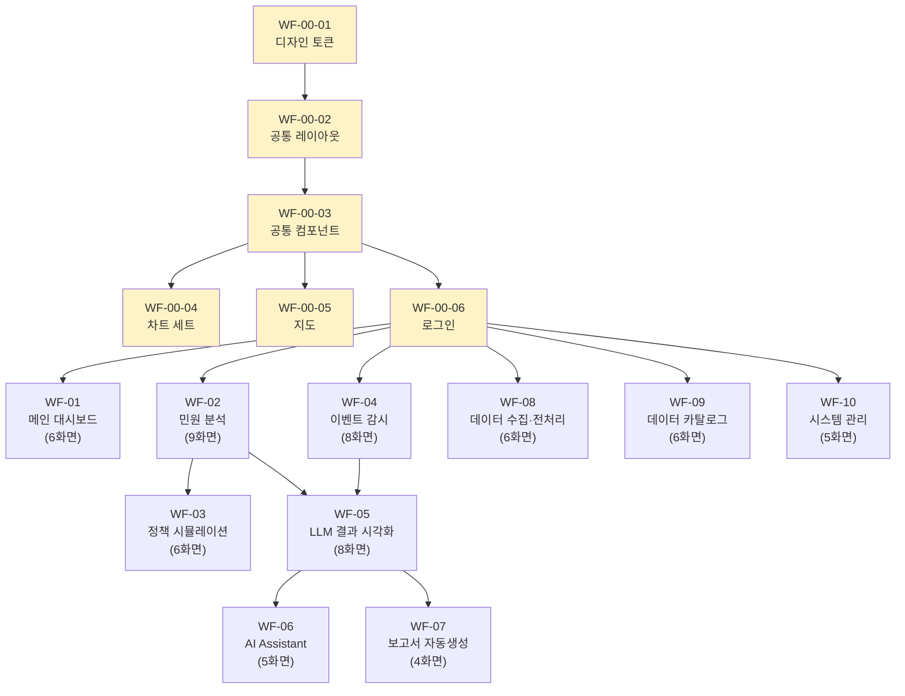

# HTML 와이어프레임 PoC — 전체 작업 개요

> 프로젝트: 2025년 제주 스마트도시 데이터허브 시범솔루션 발굴사업
> 목적: 전체 시스템 UI를 Mid-fi HTML 와이어프레임으로 제작 (기능 없이 UI만)
> 총 화면 수: 63개 + 공통 컴포넌트 6종 = **69개 task**

---

## 기술 스택

| 항목 | 선택 |
|------|------|
| 마크업 | HTML5 |
| 스타일 | Tailwind CSS (CDN) |
| 차트 | Chart.js 또는 Apache ECharts |
| 지도 | Leaflet + OpenStreetMap |
| 아이콘 | Lucide Icons |
| 더미 데이터 | 인라인 JS 또는 JSON |
| 반응형 기준 | 1920px (기본), 1440px (확인) |

---

## 폴더 구조 (산출물)

```
src/
├── common/           ← WF-00 공통기반
├── 01-main-dashboard/ ← WF-01
├── 02-complaint/      ← WF-02
├── 03-simulation/     ← WF-03
├── 04-event/          ← WF-04
├── 05-llm/            ← WF-05
├── 06-assistant/      ← WF-06
├── 07-report/         ← WF-07
├── 08-pipeline/       ← WF-08
├── 09-catalog/        ← WF-09
└── 10-admin/          ← WF-10
```

---

## 종속성 다이어그램



---

## Phase별 일정 (1인 기준)

| Phase | 기간 | 작업 그룹 | 화면 수 | 비고 |
|-------|------|----------|--------|------|
| 0 | 1주차 | WF-00 공통기반 | 6 | 모든 작업의 기반, 최우선 |
| 1 | 2~4주차 | WF-01, 02, 04, 08, 09, 10 | 40 | WF-00만 의존, 병렬 가능 |
| 2 | 5~6주차 | WF-03, 05 | 14 | WF-02/04 완료 필요 |
| 3 | 7~8주차 | WF-06, 07 | 9 | WF-05 완료 필요 |

---

## 전체 화면 체크리스트

### WF-00 공통기반 (6)
- [ ] [WF-00-01 디자인 토큰](WF-00_공통기반/WF-00-01_디자인토큰.md)
- [ ] [WF-00-02 공통 레이아웃 쉘](WF-00_공통기반/WF-00-02_공통레이아웃쉘.md)
- [ ] [WF-00-03 공통 컴포넌트 라이브러리](WF-00_공통기반/WF-00-03_공통컴포넌트라이브러리.md)
- [ ] [WF-00-04 차트 컴포넌트 세트](WF-00_공통기반/WF-00-04_차트컴포넌트세트.md)
- [ ] [WF-00-05 지도 컴포넌트](WF-00_공통기반/WF-00-05_지도컴포넌트.md)
- [ ] [WF-00-06 로그인·권한별 진입](WF-00_공통기반/WF-00-06_로그인-권한별진입.md)

### WF-01 메인 대시보드 (6)
- [ ] [WF-01-01 종합 KPI 대시보드](WF-01_메인대시보드/WF-01-01_종합KPI대시보드.md)
- [ ] [WF-01-02 실시간 현황 모니터](WF-01_메인대시보드/WF-01-02_실시간현황모니터.md)
- [ ] [WF-01-03 AI 솔루션 성과 요약](WF-01_메인대시보드/WF-01-03_AI솔루션성과요약.md)
- [ ] [WF-01-04 공지·알림 센터](WF-01_메인대시보드/WF-01-04_공지-알림센터.md)
- [ ] [WF-01-05 마이 대시보드](WF-01_메인대시보드/WF-01-05_마이대시보드.md)
- [ ] [WF-01-06 시스템 상태 모니터링](WF-01_메인대시보드/WF-01-06_시스템상태모니터링.md)

### WF-02 민원 분석 (9)
- [ ] [WF-02-01 민원 현황 대시보드](WF-02_민원분석/WF-02-01_민원현황대시보드.md)
- [ ] [WF-02-02 히트맵 분석](WF-02_민원분석/WF-02-02_히트맵분석.md)
- [ ] [WF-02-03 읍면동 비교 카드](WF-02_민원분석/WF-02-03_읍면동비교카드.md)
- [ ] [WF-02-04 시계열 트렌드 분석](WF-02_민원분석/WF-02-04_시계열트렌드분석.md)
- [ ] [WF-02-05 민원 상세 조회](WF-02_민원분석/WF-02-05_민원상세조회.md)
- [ ] [WF-02-06 민원 분류 현황](WF-02_민원분석/WF-02-06_민원분류현황.md)
- [ ] [WF-02-07 감성·감정 분석 결과](WF-02_민원분석/WF-02-07_감성-감정분석결과.md)
- [ ] [WF-02-08 GIS 집중구역 시각화](WF-02_민원분석/WF-02-08_GIS집중구역시각화.md)
- [ ] [WF-02-09 민원 목록 테이블 뷰](WF-02_민원분석/WF-02-09_민원목록테이블뷰.md)

### WF-03 정책 시뮬레이션 (6)
- [ ] [WF-03-01 시뮬레이션 설정](WF-03_정책시뮬레이션/WF-03-01_시뮬레이션설정.md)
- [ ] [WF-03-02 수요·공급·혼잡 분석](WF-03_정책시뮬레이션/WF-03-02_수요-공급-혼잡분석.md)
- [ ] [WF-03-03 정책 효과 예측 결과](WF-03_정책시뮬레이션/WF-03-03_정책효과예측결과.md)
- [ ] [WF-03-04 시나리오 비교](WF-03_정책시뮬레이션/WF-03-04_시나리오비교.md)
- [ ] [WF-03-05 요금제·공유주차 추천](WF-03_정책시뮬레이션/WF-03-05_요금제-공유주차추천.md)
- [ ] [WF-03-06 투자 우선순위 보드](WF-03_정책시뮬레이션/WF-03-06_투자우선순위보드.md)

### WF-04 이벤트 감시 (8)
- [ ] [WF-04-01 실시간 감시 콘솔](WF-04_이벤트감시/WF-04-01_실시간감시콘솔.md)
- [ ] [WF-04-02 이벤트 상세 팝업](WF-04_이벤트감시/WF-04-02_이벤트상세팝업.md)
- [ ] [WF-04-03 경보 단계별 현황](WF-04_이벤트감시/WF-04-03_경보단계별현황.md)
- [ ] [WF-04-04 센서별 상태 모니터](WF-04_이벤트감시/WF-04-04_센서별상태모니터.md)
- [ ] [WF-04-05 SOP 체크리스트](WF-04_이벤트감시/WF-04-05_SOP체크리스트.md)
- [ ] [WF-04-06 인시던트 관리](WF-04_이벤트감시/WF-04-06_인시던트관리.md)
- [ ] [WF-04-07 EV 충전 이상탐지](WF-04_이벤트감시/WF-04-07_EV충전이상탐지.md)
- [ ] [WF-04-08 통합관제 연계](WF-04_이벤트감시/WF-04-08_통합관제연계.md)

### WF-05 LLM 결과 시각화 (8)
- [ ] [WF-05-01 LLM 요약 결과 뷰어](WF-05_LLM결과시각화/WF-05-01_LLM요약결과뷰어.md)
- [ ] [WF-05-02 LLM 분류 현황](WF-05_LLM결과시각화/WF-05-02_LLM분류현황.md)
- [ ] [WF-05-03 LLM 클러스터링 시각화](WF-05_LLM결과시각화/WF-05-03_LLM클러스터링시각화.md)
- [ ] [WF-05-04 LLM 검색 인터페이스](WF-05_LLM결과시각화/WF-05-04_LLM검색인터페이스.md)
- [ ] [WF-05-05 LLM 생성 리포트 뷰어](WF-05_LLM결과시각화/WF-05-05_LLM생성리포트뷰어.md)
- [ ] [WF-05-06 민원 답변문 생성](WF-05_LLM결과시각화/WF-05-06_민원답변문생성.md)
- [ ] [WF-05-07 대량 민원 요약](WF-05_LLM결과시각화/WF-05-07_대량민원요약.md)
- [ ] [WF-05-08 모델 성능 모니터링](WF-05_LLM결과시각화/WF-05-08_모델성능모니터링.md)

### WF-06 AI Assistant (5)
- [ ] [WF-06-01 챗 인터페이스](WF-06_AI-Assistant/WF-06-01_챗인터페이스.md)
- [ ] [WF-06-02 RAG 검색 결과 패널](WF-06_AI-Assistant/WF-06-02_RAG검색결과패널.md)
- [ ] [WF-06-03 추천 응답 선택](WF-06_AI-Assistant/WF-06-03_추천응답선택.md)
- [ ] [WF-06-04 다국어 대응](WF-06_AI-Assistant/WF-06-04_다국어대응.md)
- [ ] [WF-06-05 상담 통계 대시보드](WF-06_AI-Assistant/WF-06-05_상담통계대시보드.md)

### WF-07 보고서 자동 생성 (4)
- [ ] [WF-07-01 보고서 목록·관리](WF-07_보고서자동생성/WF-07-01_보고서목록-관리.md)
- [ ] [WF-07-02 보고서 미리보기](WF-07_보고서자동생성/WF-07-02_보고서미리보기.md)
- [ ] [WF-07-03 보고서 편집·승인](WF-07_보고서자동생성/WF-07-03_보고서편집-승인.md)
- [ ] [WF-07-04 보고서 템플릿 관리](WF-07_보고서자동생성/WF-07-04_보고서템플릿관리.md)

### WF-08 데이터 수집·전처리 (6)
- [ ] [WF-08-01 데이터 수집 현황](WF-08_데이터수집전처리/WF-08-01_데이터수집현황.md)
- [ ] [WF-08-02 OCR 처리 현황](WF-08_데이터수집전처리/WF-08-02_OCR처리현황.md)
- [ ] [WF-08-03 RPA 수집 모니터](WF-08_데이터수집전처리/WF-08-03_RPA수집모니터.md)
- [ ] [WF-08-04 STT 처리 현황](WF-08_데이터수집전처리/WF-08-04_STT처리현황.md)
- [ ] [WF-08-05 개체명 추출 결과](WF-08_데이터수집전처리/WF-08-05_개체명추출결과.md)
- [ ] [WF-08-06 데이터 품질 대시보드](WF-08_데이터수집전처리/WF-08-06_데이터품질대시보드.md)

### WF-09 데이터 카탈로그 (6)
- [ ] [WF-09-01 카탈로그 메인 검색](WF-09_데이터카탈로그/WF-09-01_카탈로그메인검색.md)
- [ ] [WF-09-02 데이터셋 상세](WF-09_데이터카탈로그/WF-09-02_데이터셋상세.md)
- [ ] [WF-09-03 메타데이터 편집](WF-09_데이터카탈로그/WF-09-03_메타데이터편집.md)
- [ ] [WF-09-04 표준 용어 사전](WF-09_데이터카탈로그/WF-09-04_표준용어사전.md)
- [ ] [WF-09-05 데이터 모델 탐색](WF-09_데이터카탈로그/WF-09-05_데이터모델탐색.md)
- [ ] [WF-09-06 DCAT 외부 제공 관리](WF-09_데이터카탈로그/WF-09-06_DCAT외부제공관리.md)

### WF-10 시스템 관리 (5)
- [ ] [WF-10-01 사용자·역할 관리](WF-10_시스템관리/WF-10-01_사용자-역할관리.md)
- [ ] [WF-10-02 연계 시스템 설정](WF-10_시스템관리/WF-10-02_연계시스템설정.md)
- [ ] [WF-10-03 감사 로그](WF-10_시스템관리/WF-10-03_감사로그.md)
- [ ] [WF-10-04 알림 설정](WF-10_시스템관리/WF-10-04_알림설정.md)
- [ ] [WF-10-05 시스템 설정](WF-10_시스템관리/WF-10-05_시스템설정.md)

---

## 파일 네이밍 규칙

| 항목 | 규칙 | 예시 |
|------|------|------|
| task 파일 | `WF-{그룹}-{번호}_{화면명}.md` | `WF-02-01_민원현황대시보드.md` |
| HTML 산출물 | `WF-{그룹}-{번호}_{영문명}.html` | `WF-02-01_complaint-dashboard.html` |
| 더미 데이터 | `WF-{그룹}-{번호}_data.json` | `WF-02-01_data.json` |

---

## 담당 회사별 요약

| 담당 | 그룹 | 화면 수 |
|------|------|--------|
| 이노팸 | WF-00, 01, 02, 03, 06, 07, 10 + WF-04/05 일부 | ~45개 |
| 디토닉 | WF-05 일부, 08, 09 | ~18개 |
| 이노뎁 | WF-04 일부 | ~6개 |
