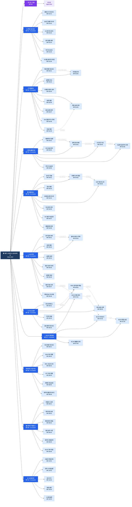

```mermaid
graph LR
    classDef root fill:#1E3A5F,stroke:#2563EB,color:#fff,font-weight:bold,font-size:16px
    classDef gnb fill:#2563EB,stroke:#1E40AF,color:#fff,font-weight:bold
    classDef lnb fill:#DBEAFE,stroke:#93C5FD,color:#1E3A5F
    classDef auth fill:#7C3AED,stroke:#5B21B6,color:#fff,font-weight:bold
    classDef authPage fill:#EDE9FE,stroke:#C4B5FD,color:#5B21B6

    ROOT["🏛️ 제주 스마트도시 데이터허브<br/>index.html"]
    ROOT --> LOGIN
    ROOT --> GNB01
    ROOT --> GNB02
    ROOT --> GNB03
    ROOT --> GNB04
    ROOT --> GNB05
    ROOT --> GNB06
    ROOT --> GNB07
    ROOT --> GNB08
    ROOT --> GNB09
    ROOT --> GNB10

    %% ── WF-00 인증 ──
    LOGIN["🔐 로그인 / 인증<br/>WF-00"]
    LOGIN --> L01["로그인<br/>login.html"]

    %% ── WF-01 메인 대시보드 ──
    GNB01["📊 메인 대시보드<br/>WF-01 · 6 screens"]
    GNB01 --> W0101["종합 KPI 대시보드<br/>WF-01-01"]
    GNB01 --> W0102["실시간 현황 모니터<br/>WF-01-02"]
    GNB01 --> W0103["AI 성과 대시보드<br/>WF-01-03"]
    GNB01 --> W0104["공지·알림 센터<br/>WF-01-04"]
    GNB01 --> W0105["마이 대시보드<br/>WF-01-05"]
    GNB01 --> W0106["시스템 상태 모니터링<br/>WF-01-06"]

    %% ── WF-02 민원분석 ──
    GNB02["📋 민원분석<br/>WF-02 · 9 screens"]
    GNB02 --> W0201["민원 현황 대시보드<br/>WF-02-01"]
    GNB02 --> W0202["히트맵 분석<br/>WF-02-02"]
    GNB02 --> W0203["읍면동 비교<br/>WF-02-03"]
    GNB02 --> W0204["시계열 트렌드 분석<br/>WF-02-04"]
    GNB02 --> W0205["민원 상세 조회<br/>WF-02-05"]
    GNB02 --> W0206["분류 현황<br/>WF-02-06"]
    GNB02 --> W0207["감성·감정 분석<br/>WF-02-07"]
    GNB02 --> W0208["GIS 집중구역 시각화<br/>WF-02-08"]
    GNB02 --> W0209["민원 목록<br/>WF-02-09"]

    %% ── WF-03 정책시뮬레이션 ──
    GNB03["🧪 정책시뮬레이션<br/>WF-03 · 6 screens"]
    GNB03 --> W0301["시뮬레이션 설정<br/>WF-03-01"]
    GNB03 --> W0302["수요·공급 분석<br/>WF-03-02"]
    GNB03 --> W0303["정책 효과 예측<br/>WF-03-03"]
    GNB03 --> W0304["시나리오 비교<br/>WF-03-04"]
    GNB03 --> W0305["요금제·공유주차 추천<br/>WF-03-05"]
    GNB03 --> W0306["투자 우선순위<br/>WF-03-06"]

    %% ── WF-04 이벤트감시 ──
    GNB04["🛡️ 이벤트감시<br/>WF-04 · 8 screens"]
    GNB04 --> W0401["실시간 콘솔<br/>WF-04-01"]
    GNB04 --> W0402["이벤트 상세 팝업<br/>WF-04-02"]
    GNB04 --> W0403["경보 현황<br/>WF-04-03"]
    GNB04 --> W0404["센서별 상태 모니터<br/>WF-04-04"]
    GNB04 --> W0405["SOP 체크리스트<br/>WF-04-05"]
    GNB04 --> W0406["인시던트 관리<br/>WF-04-06"]
    GNB04 --> W0407["EV 충전 이상감지<br/>WF-04-07"]
    GNB04 --> W0408["통합관제 연계<br/>WF-04-08"]

    %% ── WF-05 LLM분석 ──
    GNB05["🧠 LLM 분석<br/>WF-05 · 8 screens"]
    GNB05 --> W0501["요약 결과 뷰어<br/>WF-05-01"]
    GNB05 --> W0502["분류 현황<br/>WF-05-02"]
    GNB05 --> W0503["클러스터링 시각화<br/>WF-05-03"]
    GNB05 --> W0504["시맨틱 검색<br/>WF-05-04"]
    GNB05 --> W0505["생성 리포트 뷰어<br/>WF-05-05"]
    GNB05 --> W0506["답변문 생성<br/>WF-05-06"]
    GNB05 --> W0507["대량 민원 요약<br/>WF-05-07"]
    GNB05 --> W0508["모델 성능 모니터링<br/>WF-05-08"]

    %% ── WF-06 AI어시스턴트 ──
    GNB06["🤖 AI 어시스턴트<br/>WF-06 · 5 screens"]
    GNB06 --> W0601["챗 인터페이스<br/>WF-06-01"]
    GNB06 --> W0602["RAG 검색 결과 패널<br/>WF-06-02"]
    GNB06 --> W0603["추천 응답 선택<br/>WF-06-03"]
    GNB06 --> W0604["다국어 대응<br/>WF-06-04"]
    GNB06 --> W0605["상담 통계 대시보드<br/>WF-06-05"]

    %% ── WF-07 보고서 ──
    GNB07["📄 보고서 자동생성<br/>WF-07 · 4 screens"]
    GNB07 --> W0701["보고서 목록·관리<br/>WF-07-01"]
    GNB07 --> W0702["보고서 미리보기<br/>WF-07-02"]
    GNB07 --> W0703["보고서 편집·승인<br/>WF-07-03"]
    GNB07 --> W0704["보고서 템플릿 관리<br/>WF-07-04"]

    %% ── WF-08 데이터수집 ──
    GNB08["🗄️ 데이터 수집·처리<br/>WF-08 · 6 screens"]
    GNB08 --> W0801["수집 현황 대시보드<br/>WF-08-01"]
    GNB08 --> W0802["OCR 처리 현황<br/>WF-08-02"]
    GNB08 --> W0803["RPA 수집 모니터<br/>WF-08-03"]
    GNB08 --> W0804["STT 처리 현황<br/>WF-08-04"]
    GNB08 --> W0805["개체명 추출 결과<br/>WF-08-05"]
    GNB08 --> W0806["데이터 품질 대시보드<br/>WF-08-06"]

    %% ── WF-09 카탈로그 ──
    GNB09["📚 데이터 카탈로그<br/>WF-09 · 6 screens"]
    GNB09 --> W0901["카탈로그 검색<br/>WF-09-01"]
    GNB09 --> W0902["데이터셋 상세<br/>WF-09-02"]
    GNB09 --> W0903["메타데이터 편집<br/>WF-09-03"]
    GNB09 --> W0904["표준 용어 사전<br/>WF-09-04"]
    GNB09 --> W0905["데이터 모델 탐색<br/>WF-09-05"]
    GNB09 --> W0906["DCAT 외부 제공<br/>WF-09-06"]

    %% ── WF-10 시스템관리 ──
    GNB10["⚙️ 시스템 관리<br/>WF-10 · 5 screens"]
    GNB10 --> W1001["사용자·역할 관리<br/>WF-10-01"]
    GNB10 --> W1002["연계 시스템 설정<br/>WF-10-02"]
    GNB10 --> W1003["감사 로그<br/>WF-10-03"]
    GNB10 --> W1004["알림 설정<br/>WF-10-04"]
    GNB10 --> W1005["시스템 설정<br/>WF-10-05"]

    %% ── 화면 간 연계 (점선) ──
    W0209 -.->|상세 조회| W0205
    W0201 -.->|히트맵 드릴다운| W0202
    W0301 -.->|시뮬레이션 실행| W0303
    W0303 -.->|시나리오 비교| W0304
    W0304 -.->|추천 적용| W0305
    W0501 -.->|클러스터 분석| W0503
    W0507 -.->|보고서 연동| W0701
    W0701 -.->|미리보기| W0702
    W0702 -.->|편집| W0703
    W0601 -.->|RAG 연동| W0602
    W0602 -.->|추천 응답| W0603
    W0401 -.->|이벤트 클릭| W0402
    W0402 -.->|SOP 실행| W0405

    %% ── 스타일 적용 ──
    class ROOT root
    class LOGIN auth
    class L01 authPage
    class GNB01,GNB02,GNB03,GNB04,GNB05,GNB06,GNB07,GNB08,GNB09,GNB10 gnb
    class W0101,W0102,W0103,W0104,W0105,W0106 lnb
    class W0201,W0202,W0203,W0204,W0205,W0206,W0207,W0208,W0209 lnb
    class W0301,W0302,W0303,W0304,W0305,W0306 lnb
    class W0401,W0402,W0403,W0404,W0405,W0406,W0407,W0408 lnb
    class W0501,W0502,W0503,W0504,W0505,W0506,W0507,W0508 lnb
    class W0601,W0602,W0603,W0604,W0605 lnb
    class W0701,W0702,W0703,W0704 lnb
    class W0801,W0802,W0803,W0804,W0805,W0806 lnb
    class W0901,W0902,W0903,W0904,W0905,W0906 lnb
    class W1001,W1002,W1003,W1004,W1005 lnb
```
