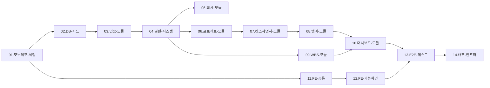
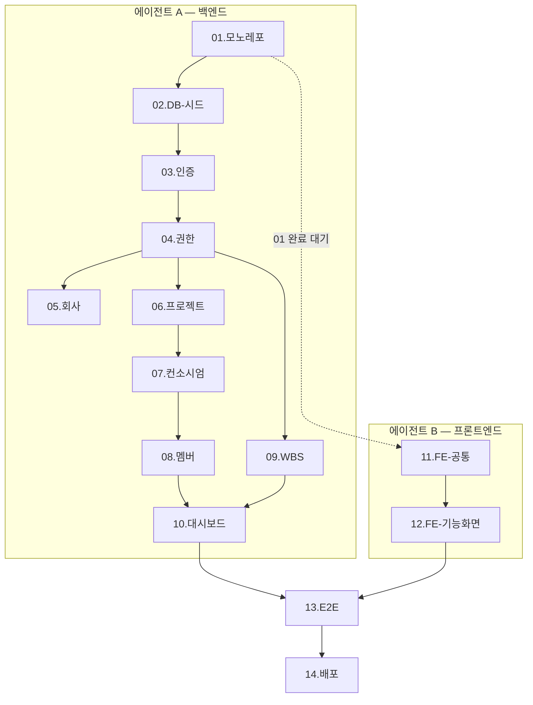
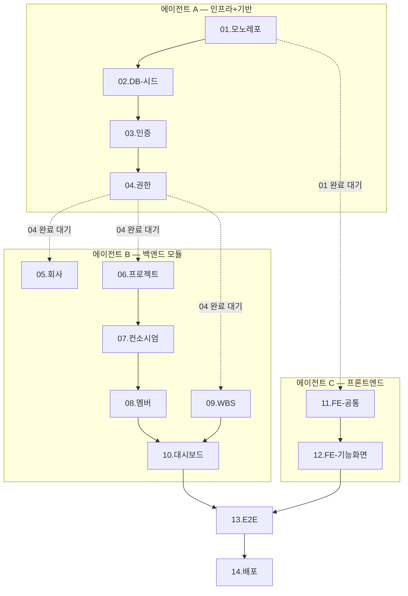

# 의존성 맵

## 예상 소요시간
| 구분 | 시간 |
|------|------|
| 사람 (숙련 개발자) | 참조 문서 — 별도 수행 작업 없음 |
| AI 에이전트 | 참조 문서 — 별도 수행 작업 없음 |

## What (무엇을)
전체 작업(01~14) 간의 선행/후행 의존 관계와 병렬 실행 가능 여부를 정의한다.
각 수행 가이드의 "선행 작업" 항목은 이 문서를 기준으로 작성되었다.

## Why (왜)
작업 순서를 잘못 잡으면 FK 참조 오류, 모듈 미존재 에러 등이 발생한다.
에이전트가 병렬로 작업할 때도 이 맵을 보고 안전한 병렬 조합을 판단할 수 있다.

---

## 전체 의존성 흐름도



## 의존성 상세표

| 작업 | 선행 필수 | 병렬 가능 | 비고 |
|------|-----------|-----------|------|
| 01.모노레포-프로젝트-세팅 | 없음 | — | 최초 시작점 |
| 02.DB-스키마-시드데이터 | 01 완료 | — | Prisma 마이그레이션 + 시드 |
| 03.인증-모듈 | 02 완료 | — | JWT, User 테이블 필요 |
| 04.권한-시스템 | 03 완료 | — | 인증 미들웨어 의존 |
| 05.회사-모듈 | 04 완료 | **05 ↔ 06** | Company CRUD |
| 06.프로젝트-모듈 | 04 완료 | **05 ↔ 06** | Project CRUD |
| 07.컨소시엄사-모듈 | 06 완료 | — | ProjectCompany → Project FK |
| 08.멤버-모듈 | 07 완료 | **08 ↔ 09** | ProjectMember → ProjectCompany FK |
| 09.WBS-모듈 | 04 완료 | **08 ↔ 09** | WbsNode, Scope 적용 |
| 10.대시보드-모듈 | 08 + 09 완료 | — | 멤버+WBS 집계 필요 |
| 11.프론트엔드-공통 | 01 완료 | **백엔드(03~10)와 병렬** | 라우팅, 레이아웃, API 클라이언트 |
| 12.프론트엔드-기능화면 | 11 + 해당 백엔드 모듈 | — | 각 화면별 API 의존 |
| 13.통합테스트-E2E | 10 + 12 완료 | — | 프론트+백 전체 필요 |
| 14.배포-인프라 | 13 완료 | — | 테스트 통과 후 |

## 병렬 실행 가이드

### 에이전트 2개



### 에이전트 3개



## 크리티컬 패스

```
01 → 02 → 03 → 04 → 06 → 07 → 08 → 10 → 13 → 14
```

09.WBS는 04 이후 08과 병렬 진행 가능하므로, 크리티컬 패스에는 포함되지 않는다.
단, 09.WBS가 10.대시보드의 선행 조건이므로, 08과 09 중 늦게 끝나는 쪽이 병목이 된다.

## 주의사항

- **FK 순서**: Company → Project → ProjectCompany → ProjectMember → WbsNode
- **권한 Guard**: 04번 완료 전에는 05~10번에서 `@RequirePermission` 데코레이터 사용 불가
- **프론트엔드**: 11번은 백엔드 없이 시작 가능, 12번은 각 화면의 백엔드 API 필요
- **시드 데이터**: 02번의 Role/Permission 시드 없이는 04번 권한 Guard 테스트 불가
