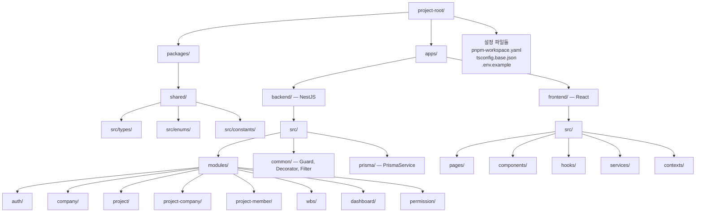

# 기술스택 및 코딩 컨벤션

## 예상 소요시간


| 구분               | 시간                             |
| -------------------- | ---------------------------------- |
| 사람 (숙련 개발자) | 참조 문서 — 별도 수행 작업 없음 |
| AI 에이전트        | 참조 문서 — 별도 수행 작업 없음 |

## What (무엇을)

전체 프로젝트에서 공통으로 참조할 기술스택, 폴더 구조, 네이밍 규칙, API 응답 포맷을 정의한다.
모든 수행 가이드(01~14)는 이 문서의 규칙을 따른다.

## Why (왜)

여러 작업을 병렬로 진행하거나 에이전트가 개별 작업을 수행할 때, 일관된 스타일이어야 통합 시 충돌이 없다.

---

## 기술스택


| 영역          | 기술                       | 비고               |
| --------------- | ---------------------------- | -------------------- |
| 프론트엔드    | React + Vite(react-swc-ts) | React 18+          |
| 백엔드        | NestJS + TypeScript        | NestJS 10+         |
| DB            | PostgreSQL                 | 15+                |
| ORM           | Prisma                     | 6+                 |
| PPT 생성      | pptxgenjs                  | 2단계              |
| 엑셀 생성     | exceljs                    | 2단계              |
| 인증          | JWT (access + refresh)     |                    |
| 패키지 매니저 | pnpm                       | 모노레포 workspace |

## 모노레포 폴더 구조



### 텍스트 기준 구조

```
project-root/
├── packages/
│   └── shared/                    # 프론트-백 공유 타입/상수
│       ├── src/
│       │   ├── types/             # WbsNodeDto, UserDto 등
│       │   ├── enums/             # Resource, Action, Scope, CompanyRole, WbsType
│       │   └── constants/         # 공통 상수
│       ├── package.json
│       └── tsconfig.json
├── apps/
│   ├── backend/                   # NestJS 앱
│   │   ├── src/
│   │   │   ├── modules/           # 기능 모듈
│   │   │   │   ├── auth/
│   │   │   │   ├── company/
│   │   │   │   ├── project/
│   │   │   │   ├── project-company/
│   │   │   │   ├── project-member/
│   │   │   │   ├── wbs/
│   │   │   │   ├── dashboard/
│   │   │   │   └── permission/
│   │   │   ├── common/            # Guard, Decorator, Filter, Interceptor
│   │   │   ├── prisma/            # PrismaService, PrismaModule
│   │   │   └── main.ts
│   │   ├── prisma/
│   │   │   ├── schema.prisma
│   │   │   ├── migrations/
│   │   │   └── seed.ts
│   │   └── package.json
│   └── frontend/                  # React 앱
│       ├── src/
│       │   ├── pages/             # 라우트별 페이지
│       │   ├── components/        # 공통 UI 컴포넌트
│       │   ├── hooks/             # 커스텀 훅
│       │   ├── services/          # API 호출 함수
│       │   ├── contexts/          # React Context (Auth 등)
│       │   ├── types/             # 프론트 전용 타입
│       │   └── utils/             # 유틸리티
│       └── package.json
├── pnpm-workspace.yaml
├── package.json
├── tsconfig.base.json
├── .env.example
└── .gitignore
```

## 네이밍 규칙

### 파일/폴더


| 대상                 | 규칙                | 예시                            |
| ---------------------- | --------------------- | --------------------------------- |
| NestJS 모듈 폴더     | kebab-case          | `project-company/`              |
| NestJS 파일          | kebab-case + 접미사 | `project-company.controller.ts` |
| React 컴포넌트       | PascalCase.tsx      | `WbsEditor.tsx`                 |
| 타입/인터페이스 파일 | kebab-case.ts       | `wbs-node.ts`                   |

### 코드


| 대상               | 규칙                   | 예시                                  |
| -------------------- | ------------------------ | --------------------------------------- |
| primitive 변수     | lower_snake_case       | `user_id`,`wbs_node_id`               |
| instance 변수      | camelCase              | `fooService`,`wbsCalculator`          |
| 함수               | camelCase              | `projectId`, `findByCompany()`        |
| 클래스, 인터페이스 | PascalCase             | `ProjectCompanyService`, `WbsNodeDto` |
| 상수, Enum 값      | UPPER_SNAKE_CASE       | `OWN_COMPANY`, `PRIME`                |
| DB 컬럼            | snake_case             | `created_at` (Prisma `@map`)          |
| DB 테이블          | snake_case with plural | `projects` (Prisma `@map`)            |

### API URL


| 규칙                    | 예시                             |
| ------------------------- | ---------------------------------- |
| 복수형 kebab-case       | `/api/v1/wbs-nodes`              |
| 네스트 리소스           | `/api/v1/projects/:id/companies` |
| 쿼리 파라미터 camelCase | `?keyword=검색어`                |

## API 응답 포맷

모든 API는 아래 형식을 따른다:

```typescript
interface APIResponse<T = { [key: string]: any }> {
  code: number; // 6자리: 앞 3자리 HTTP status + 뒤 3자리 의도
  message?: string;
  result: T;
}
```

### 응답 코드 목록


| 코드   | 의미                  |
| -------- | ----------------------- |
| 200000 | OK                    |
| 201000 | Created               |
| 400000 | Bad Request           |
| 400001 | Validation Error      |
| 400002 | Invalid Parameter     |
| 401000 | Unauthorized          |
| 401001 | Token Expired         |
| 403000 | Forbidden             |
| 403001 | Insufficient Scope    |
| 404000 | Not Found             |
| 409000 | Conflict              |
| 409001 | Duplicate Member      |
| 409002 | Overlap Input Rate    |
| 500000 | Internal Server Error |

## Soft Delete 규칙

- 모든 테이블에 `deleted_at` 컬럼
- DELETE API → `deleted_at = now()` 처리
- 조회 시 항상 `WHERE deleted_at IS NULL`
- Prisma 미들웨어 또는 서비스 레벨에서 처리

## 공유 Enum (packages/shared)

```typescript
// packages/shared/src/enums/permission.ts
export enum Resource {
  WBS = "WBS",
  REPORT = "REPORT",
  TIMESHEET = "TIMESHEET",
  MEMBER = "MEMBER",
  COMPANY = "COMPANY",
  PROJECT = "PROJECT",
  DELIVERABLE = "DELIVERABLE",
  ISSUE = "ISSUE",
  RISK = "RISK",
  CHANGE = "CHANGE",
  AUDIT = "AUDIT",
  CLOSE = "CLOSE",
}

export enum Action {
  VIEW = "VIEW",
  EDIT = "EDIT",
  CREATE = "CREATE",
  DELETE = "DELETE",
  INVITE = "INVITE",
  REMOVE = "REMOVE",
  APPROVE = "APPROVE",
  REQUEST = "REQUEST",
  DOWNLOAD = "DOWNLOAD",
  MANAGE = "MANAGE",
  SETTING = "SETTING",
}

export enum Scope {
  ALL = "ALL",
  OWN_COMPANY = "OWN_COMPANY",
  OWN_TASK = "OWN_TASK",
  NONE = "NONE",
}

// packages/shared/src/enums/company-role.ts
export enum CompanyRole {
  OWNER = "OWNER",
  PRIME = "PRIME",
  PARTNER = "PARTNER",
  SUB = "SUB",
}

// packages/shared/src/enums/wbs-type.ts
export enum WbsType {
  CATEGORY = "CATEGORY",
  TASK = "TASK",
}
```

## NestJS 모듈 기본 구조

각 모듈 폴더에 아래 파일을 생성한다:

```
modules/{module-name}/
├── {module-name}.module.ts
├── {module-name}.controller.ts
├── {module-name}.service.ts
├── dto/
│   ├── create-{module-name}.dto.ts
│   └── update-{module-name}.dto.ts
└── {module-name}.controller.spec.ts   (선택)
```

## Git 규칙

- `.env` → `.gitignore` 포함
- `.env.example` 커밋하여 환경변수 목록 공유
- 커밋 메시지 접두사: `feat:`, `fix:`, `refactor:`, `docs:`, `chore:`, `test:`
