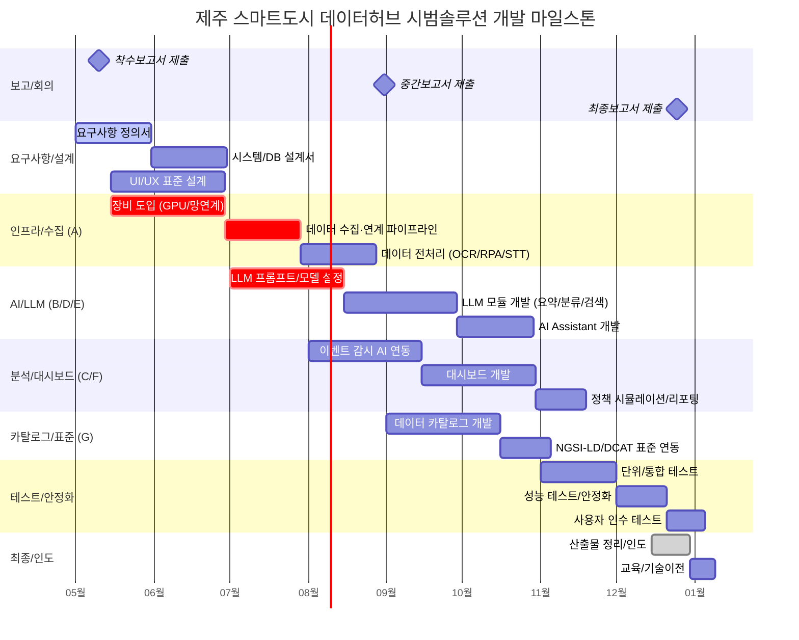
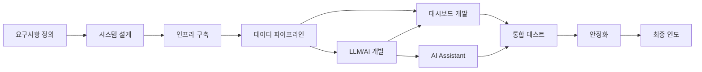

# 일정 마일스톤

> 제주 스마트도시 데이터허브 시범솔루션 발굴사업
> 개발기간: 계약 후 8개월
> 작성일: 2026-04-05

## 전제 조건

- 기준일: 계약 체결일 (T-0)
- 총 기간: 8개월 (약 34주)
- 보고 체계: 착수보고(T+10일), 주간보고(매주), 월간보고(매월 첫째 주), 중간보고(4개월차), 최종보고(완료 1주일 전)

## 마일스톤 일정

## 상세 마일스톤

### Phase 1: 요구사항 정의 및 설계 (1~2개월차)

| #   | 마일스톤              | 시기    | 산출물                   | 담당       |
| --- | --------------------- | ------- | ------------------------ | ---------- |
| M1  | 착수보고서 제출       | T+10일  | 착수보고서               | 디토닉(PM) |
| M2  | 요구사항 정의서 완료  | 1개월차 | 요구사항 정의서          | 전사       |
| M3  | 시스템/DB 설계서 완료 | 2개월차 | 시스템설계서, DB설계서   | 전사       |
| M4  | UI/UX 표준 설계 완료  | 2개월차 | UI/UX 가이드, 화면설계서 | 이노팸     |

### Phase 2: 인프라 구축 및 데이터 파이프라인 (2~4개월차)

| #   | 마일스톤                         | 시기    | 산출물               | 담당       |
| --- | -------------------------------- | ------- | -------------------- | ---------- |
| M5  | 장비 도입 완료                   | 3개월차 | 장비 검수서          | 디토닉     |
| M6  | 데이터 수집·연계 파이프라인 구축 | 3개월차 | 연동 테스트 결과서   | 디토닉     |
| M7  | 데이터 전처리 모듈 구축          | 4개월차 | 전처리 테스트 결과서 | 디토닉     |
| M8  | 중간보고서 제출                  | 4개월차 | 중간보고서           | 디토닉(PM) |

### Phase 3: AI/LLM 및 분석 기능 개발 (4~6개월차)

| #   | 마일스톤                    | 시기    | 산출물                  | 담당          |
| --- | --------------------------- | ------- | ----------------------- | ------------- |
| M9  | LLM 프롬프트/모델 설정 완료 | 4개월차 | 프롬프트 템플릿 정의서  | 디토닉        |
| M10 | LLM 모듈 개발 완료          | 6개월차 | LLM 테스트 결과서       | 디토닉·이노팸 |
| M11 | AI Assistant 개발 완료      | 6개월차 | Assistant 테스트 결과서 | 이노팸        |
| M12 | 이벤트 감시 AI 연동 완료    | 6개월차 | 연동 테스트 결과서      | 이노뎁        |

### Phase 4: 대시보드 및 카탈로그 개발 (5~7개월차)

| #   | 마일스톤                    | 시기    | 산출물             | 담당   |
| --- | --------------------------- | ------- | ------------------ | ------ |
| M13 | 대시보드 개발 완료          | 7개월차 | 대시보드 시연      | 이노팸 |
| M14 | 데이터 카탈로그 개발 완료   | 7개월차 | 카탈로그 시연      | 디토닉 |
| M15 | NGSI-LD/DCAT 표준 연동 완료 | 7개월차 | 표준 적합성 검증서 | 디토닉 |

### Phase 5: 테스트 및 안정화 (7~8개월차)

| #   | 마일스톤                | 시기    | 산출물             | 담당   |
| --- | ----------------------- | ------- | ------------------ | ------ |
| M16 | 단위/통합 테스트 완료   | 7개월차 | 시험결과서         | 전사   |
| M17 | 성능 테스트/안정화 완료 | 8개월차 | 성능 테스트 결과서 | 전사   |
| M18 | 사용자 인수 테스트 완료 | 8개월차 | 인수 테스트 결과서 | 발주처 |

### Phase 6: 최종 인도 (8개월차)

| #   | 마일스톤           | 시기          | 산출물                                  | 담당       |
| --- | ------------------ | ------------- | --------------------------------------- | ---------- |
| M19 | 최종보고서 제출    | 완료 1주일 전 | 최종보고서                              | 디토닉(PM) |
| M20 | 산출물 정리/인도   | 완료 시점     | 요구사항정의서, 설계서, 소스, 매뉴얼 등 | 전사       |
| M21 | 교육/기술이전 완료 | 완료 시점     | 교육 자료, 교육 이수 확인서             | 전사       |

## 핵심 의존 관계

## 주의 사항

1. **장비 도입 리드타임**: GPU 서버, 망연계 시스템 등 장비 도입은 발주가 늦어지면 전체 일정에 연쇄 영향
2. **LLM API 키/라이선스**: LG 엑사원 유료 버전 라이선스 계약 시점 확인 필요
3. **현장 설치 일정**: 이노뎁의 센서/CCTV 설치는 외부 환경(날씨, 허가 등)에 영향받음
4. **중간보고(4개월차)**: 이 시점까지 데이터 파이프라인과 LLM 기본 기능이 동작해야 함

## 변경 이력

| 일자       | 변경 내용 | 변경자 |
| ---------- | --------- | ------ |
| 2026-04-05 | 초기 작성 | —      |
