# 디자인 시스템 구축 프로세스

> Zero → Completed Outputs  
> Input / Output · 단계 간 인계 · Greenfield/Brownfield 분기 · Back Propagation 포함

---

## 목차

1. [전체 개괄 도식](#1-전체-개괄-도식)
2. [Phase 1 — Discovery](#2-phase-1--discovery-발견)
3. [Phase 2 — Foundation](#3-phase-2--foundation-기반-구축)
4. [Phase 3 — Build](#4-phase-3--build-컴포넌트-제작)
5. [Phase 4 — Ship](#5-phase-4--ship-배포)
6. [Phase 5 — Evolve](#6-phase-5--evolve-지속-운영)
7. [전체 연결 흐름 + Back Propagation 요약](#7-전체-연결-흐름--back-propagation-요약)

---

## 1. 전체 개괄 도식

> Greenfield/Brownfield 분기, Phase 간 인계, Back Propagation 루프를 한눈에 표현한다.

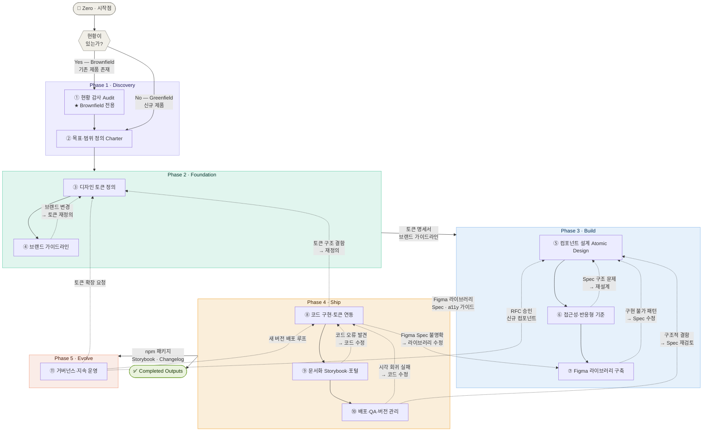

> **범례**  
> `──▶` 순방향 인계 흐름  
> `--▶` Back Propagation (문제 발생 시 역방향 수정)

---

## 2. Phase 1 — Discovery (발견)

> **핵심 분기점**: 현황이 있으면 Brownfield, 없으면 Greenfield.  
> Step①은 Brownfield에서만 필요하다. Greenfield는 Step②부터 시작한다.

### 2-0. 분기 조건 판단

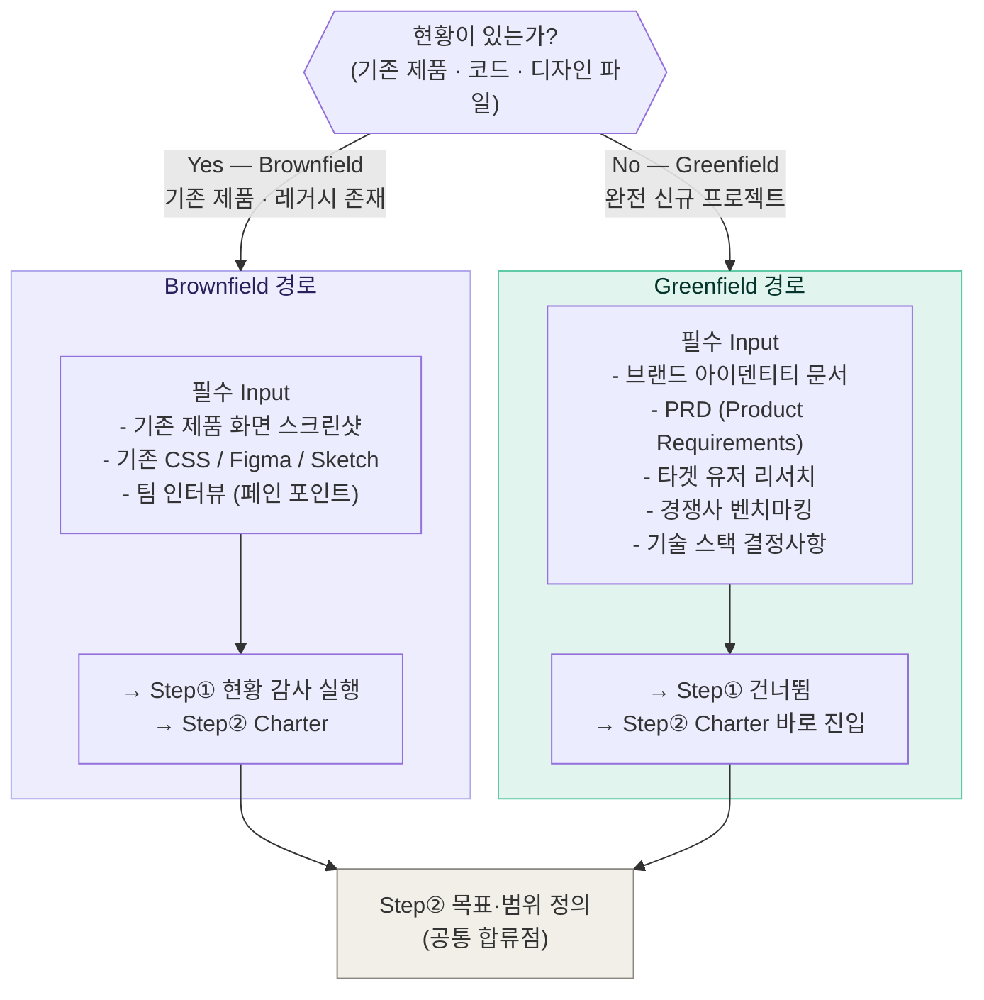

> **Greenfield 주의사항**  
> 현황이 없을수록 추상화 과잉 위험이 크다.  
> "미래에 필요할 것 같아서" 만드는 컴포넌트는 MVP에서 제외한다.  
> 실제 화면 3~5개를 먼저 설계하고, 반복되는 패턴만 컴포넌트로 추출하는 방식을 권장한다.

---

### 2-1. Step① 현황 감사 — Brownfield 전용

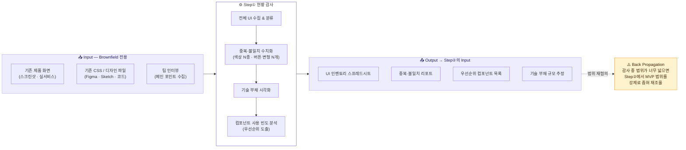

---

### 2-2. Step② 목표·범위 정의 (공통 합류점)

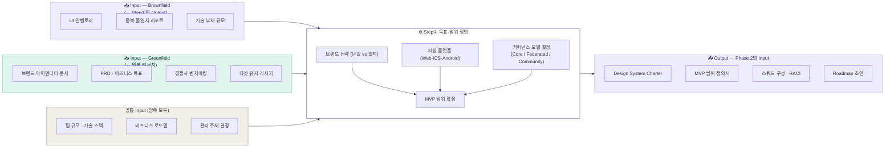

---

## 3. Phase 2 — Foundation (기반 구축)

> Charter를 기반으로 **디자인 언어의 원자 단위**를 정의한다.  
> 토큰이 불안정하면 이후 모든 단계가 흔들리므로 Back Propagation이 가장 빈번하게 발생하는 구간이다.

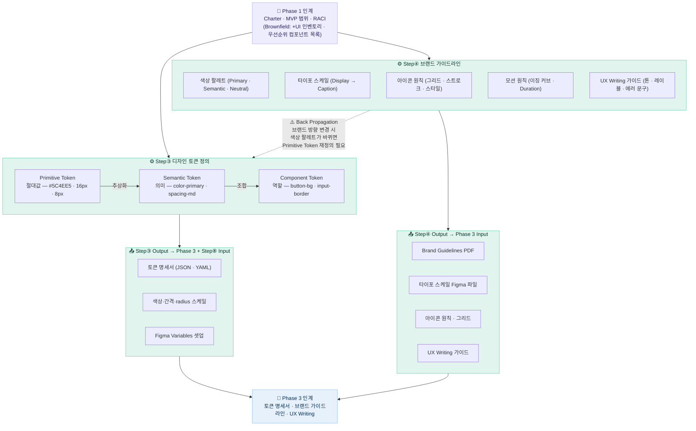

> **토큰 3계층 원칙**  
> `Primitive` 절대값 → `Semantic` 의미 부여 → `Component` 역할 특정.  
> 다크모드·멀티 브랜드 전환 시 **Primitive만 교체**하면 Semantic·Component가 자동으로 따라온다.

---

## 4. Phase 3 — Build (컴포넌트 제작)

> 토큰과 가이드라인을 기반으로 **컴포넌트를 설계하고 Figma 라이브러리를 완성**한다.  
> Spec이 흔들리면 Step⑤로 돌아가는 Back Propagation이 Step⑥⑦ 모두에서 발생한다.

### 4-1. Step⑤ 컴포넌트 설계 (Atomic Design)

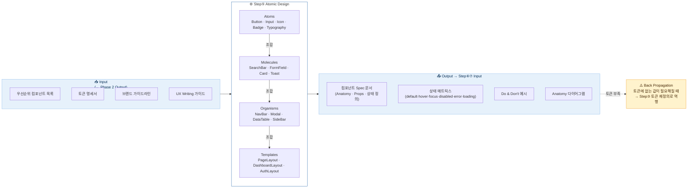

---

### 4-2. Step⑥ 접근성 · 반응형 기준

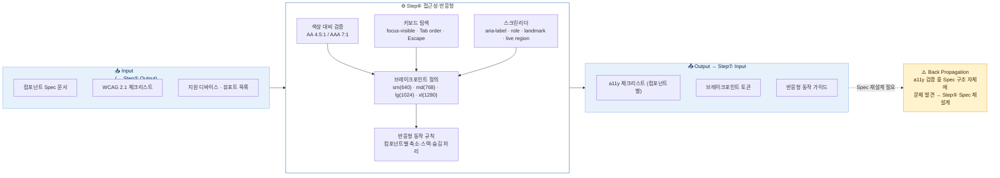

---

### 4-3. Step⑦ Figma 라이브러리 구축

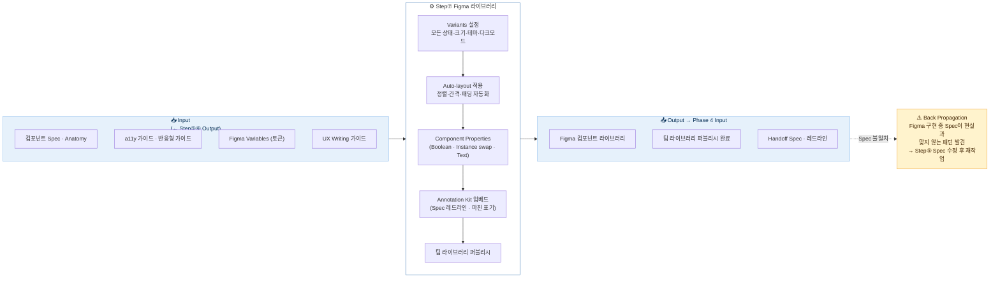

---

## 5. Phase 4 — Ship (배포)

> Figma 라이브러리를 **실제 동작하는 코드**로 구현하고, 문서화·배포를 완성한다.  
> Back Propagation이 가장 다양한 방향으로 발생하는 구간이다.

### 5-1. Step⑧ 코드 구현 · 토큰 연동

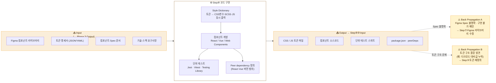

---

### 5-2. Step⑨ 문서화 (Storybook · 포털)

```mermaid
flowchart LR
    subgraph IN["📥 Input\n(← Step⑧ Output)"]
        direction TB
        I1["컴포넌트 소스코드"]
        I2["컴포넌트 Spec · Do/Don't"]
        I3["a11y 체크리스트"]
        I4["UX Writing 가이드"]
    end

    subgraph STEP["⚙️ Step⑨ 문서화"]
        direction TB
        D1["Storybook\n(Props · 상태 자동 문서화)"]
        D2["디자인 포털\n(Zeroheight · Supernova 등)"]
        D3["Migration 가이드\n기존 코드 → 신규 컴포넌트 대응표"]
        D4["Contribution Guide\n기여 방법 · 커밋 컨벤션 · PR 템플릿"]
        D1 & D2 & D3 & D4
    end

    subgraph OUT["📤 Output → Step⑩ Input"]
        direction TB
        O1["Storybook 사이트 (배포 URL)"]
        O2["디자인 시스템 포털"]
        O3["Migration 가이드 문서"]
        O4["CONTRIBUTING.md"]
    end

    IN --> STEP --> OUT

    BP["⚠️ Back Propagation\n문서화 과정에서 Props 설계 오류\n또는 예제 구현 불가 케이스 발견\n→ Step⑧ 코드 수정"]
    OUT -.->|"코드 오류 발견"| BP

    style IN fill:#FAEEDA,stroke:#EF9F27,color:#412402
    style OUT fill:#FAEEDA,stroke:#EF9F27,color:#412402
    style STEP fill:#ffffff,stroke:#854F0B
    style BP fill:#FFF3CD,stroke:#EF9F27,color:#412402
```

---

### 5-3. Step⑩ 배포 · QA · 버전 관리

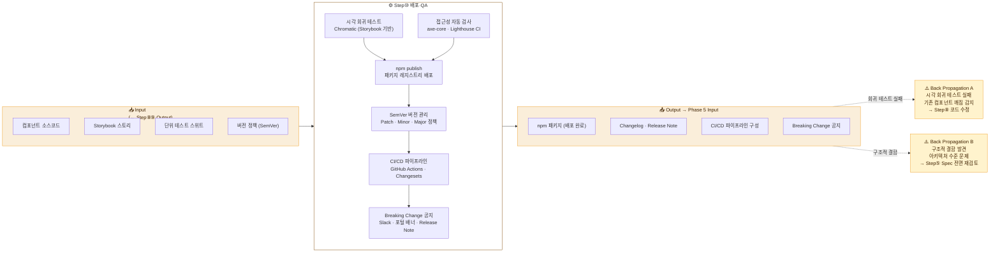

---

## 6. Phase 5 — Evolve (지속 운영)

> 배포 이후가 진짜 시작이다. **피드백을 구조화**해 시스템을 지속적으로 성장시킨다.  
> 이 Phase 자체가 하나의 거대한 Back Propagation 루프다.

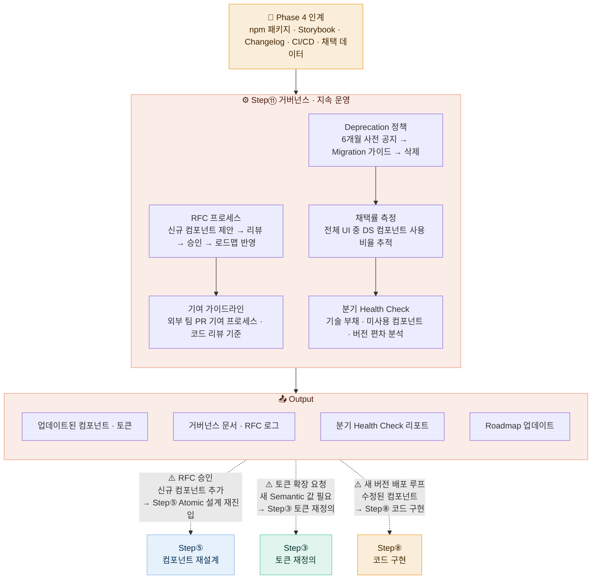

> **거버넌스 모델 비교**
>
> | 모델      | 설명                      | 적합한 조직              |
> | --------- | ------------------------- | ------------------------ |
> | Core Team | 전담 DS 팀이 단독 관리    | 대규모 조직, 일관성 우선 |
> | Federated | 각 팀이 기여, Core가 검수 | 중규모, 속도·다양성 균형 |
> | Community | 완전 오픈 기여            | 오픈소스 · 스타트업      |

---

## 7. 전체 연결 흐름 + Back Propagation 요약

> 순방향 인계(`──▶`)와 Back Propagation(`--▶`)을 하나의 다이어그램으로 통합한다.

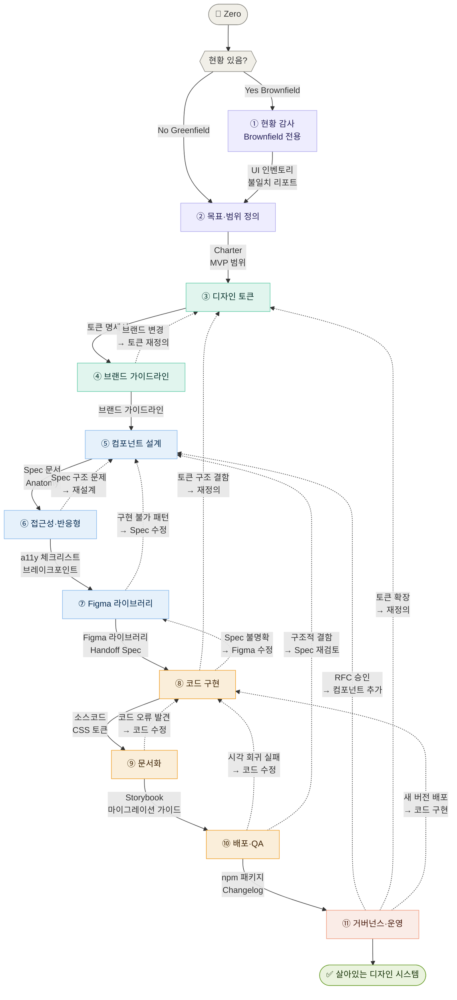

### Back Propagation 발생 조건 요약표

| 발생 위치     | 목적지           | 트리거 조건                                   | 영향 범위                  |
| ------------- | ---------------- | --------------------------------------------- | -------------------------- |
| Step④ → Step③ | 토큰 재정의      | 브랜드 방향 변경으로 색상 팔레트 교체         | 토큰 전체 재출력 필요      |
| Step⑥ → Step⑤ | Spec 재설계      | a11y 검증 중 구조적 문제 발견                 | 해당 컴포넌트 Spec 수정    |
| Step⑦ → Step⑤ | Spec 수정        | Figma에서 구현 불가 패턴 발견                 | Spec 일부 재작성           |
| Step⑧ → Step③ | 토큰 재정의      | 다크모드 대비값 누락 등 토큰 구조 결함        | CSS 토큰 파일 재출력       |
| Step⑧ → Step⑦ | Figma 수정       | Spec 불명확·핸드오프 오류                     | Figma 특정 컴포넌트 수정   |
| Step⑨ → Step⑧ | 코드 수정        | 문서화 중 Props 설계 오류 또는 예제 구현 불가 | 해당 컴포넌트 코드 수정    |
| Step⑩ → Step⑧ | 코드 수정        | 시각 회귀 테스트 실패                         | 회귀 발생 컴포넌트 수정    |
| Step⑩ → Step⑤ | Spec 전면 재검토 | 아키텍처 수준의 구조적 결함                   | 대규모 재작업 (Major 버전) |
| Step⑪ → Step⑤ | 컴포넌트 추가    | RFC 승인으로 신규 컴포넌트 결정               | Atomic 설계 재진입         |
| Step⑪ → Step③ | 토큰 확장        | 새 Semantic 토큰 요청 (예: 상태 색상 추가)    | 토큰 명세서 업데이트       |
| Step⑪ → Step⑧ | 새 버전 배포     | 수정·추가된 컴포넌트의 코드 구현 시작         | 정기 릴리스 루프           |

---

## 참고: 주요 도구 스택

| 카테고리         | 도구                                                 |
| ---------------- | ---------------------------------------------------- |
| 디자인           | Figma (라이브러리·Variants·Variables·Annotation Kit) |
| 토큰 관리        | Style Dictionary, Theo                               |
| 토큰 싱크        | Token Studio, Figma Tokens                           |
| 컴포넌트 개발    | React, Vue, Stencil (Web Components)                 |
| 문서화           | Storybook, Zeroheight, Supernova                     |
| 시각 회귀 테스트 | Chromatic, Percy                                     |
| 접근성 검사      | axe-core, Lighthouse CI, WAVE                        |
| 배포             | npm, GitHub Packages                                 |
| 버전 관리        | Changesets, semantic-release                         |
| CI/CD            | GitHub Actions, CircleCI                             |

---

_디자인 시스템은 완성형이 아니라 지속적으로 진화하는 살아있는 제품이다._  
_Back Propagation은 실패가 아니라 시스템이 건강하게 작동하고 있다는 신호다._
