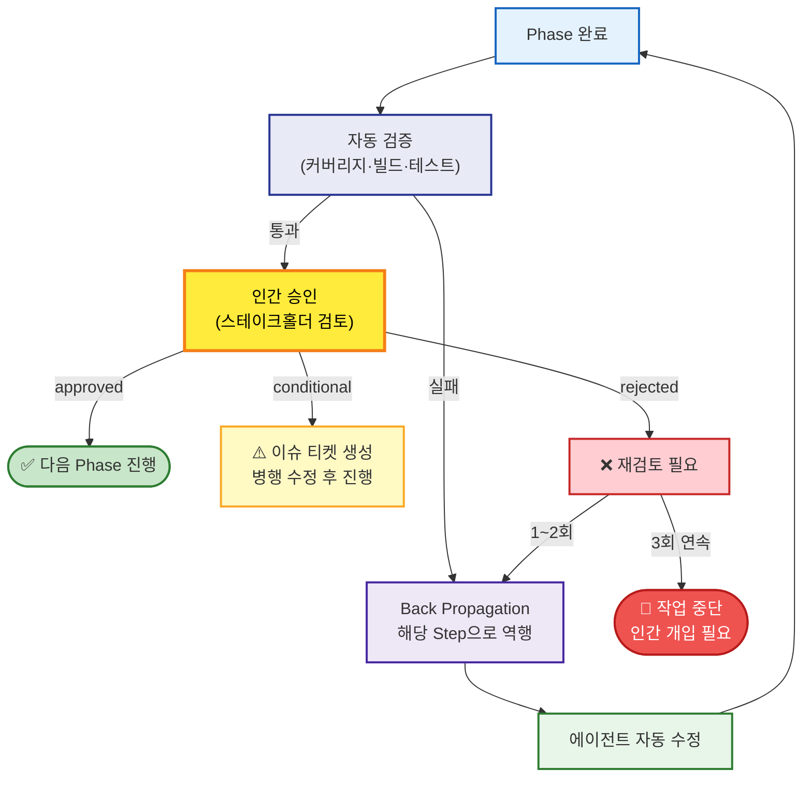
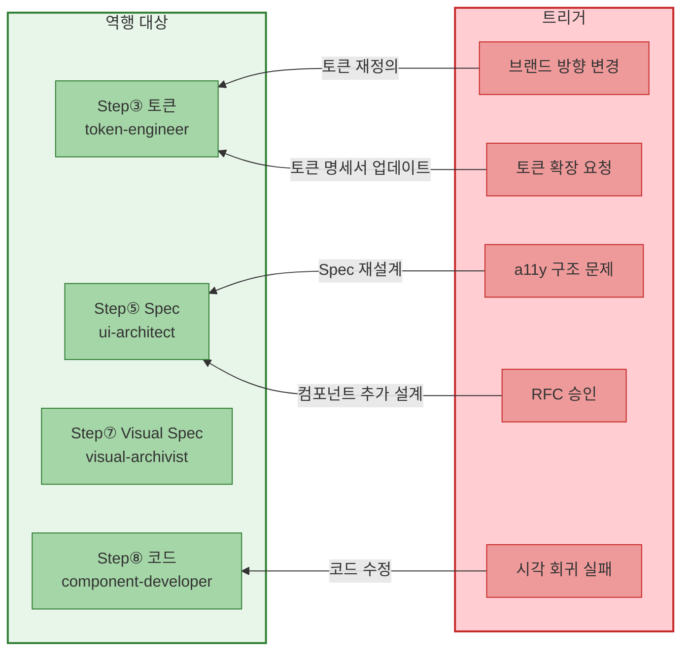

# 디자인 시스템 AI 하네스

멀티 에이전트 오케스트레이션으로 디자인 시스템 구축 프로세스를 자동화한다.

**OpenCode** 또는 **Claude Code** 중 선택하여 프로젝트를 생성할 수 있다.

**Code-First**를 기본으로 하며, 고객 요청 시 **Penpot 시안을 On-Demand로 생성**한다. 여러 디자인 시스템을 **동시에** 진행할 수 있다.

---

## 개요

디자인 시스템 구축의 5개 Phase(Discovery → Foundation → Build → Ship → Evolve)를 12개 전문 에이전트가 분담하여 처리한다. Figma 없이 Code-First로 진행하며, 고객 미팅용 시각 자료는 Penpot으로 선택적 생성한다.

```
Phase 1: Discovery  →  Phase 2: Foundation  →  Phase 3: Build  →  Phase 4: Ship  →  Phase 5: Evolve
   (감사·기획)           (토큰·브랜드)           (설계·검증)          (구현·배포)          (운영·거버넌스)
```

### 전체 파이프라인 흐름도

```mermaid
flowchart LR
    subgraph P1["Phase 1: Discovery"]
        direction TB
        A1["🔍 auditor<br/>UI 현황 감사"]
        A2["📋 planner<br/>Charter · MVP · Roadmap"]
        A1 --> A2
    end

    G1{{"⛩ Gate 1<br/>인벤토리 100%<br/>Charter 필수 요소"}}

    subgraph P2["Phase 2: Foundation"]
        direction TB
        B1["🎨 token-engineer<br/>토큰 3계층 정의"]
        B2["🖌 brand-designer<br/>색상·타이포·모션"]
        B1 --> B2
    end

    G2{{"⛩ Gate 2<br/>토큰 무결성<br/>Style Dictionary 빌드<br/>색상 대비 AA"}}

    subgraph P3["Phase 3: Build"]
        direction TB
        C1["🧩 ui-architect<br/>Atomic Design Spec"]
        C2["♿ a11y-engineer<br/>WCAG 2.1 검증"]
        C3["📸 visual-archivist<br/>Storybook 시각 Spec"]
        C1 --> C2 --> C3
    end

    G3{{"⛩ Gate 3<br/>Spec 완성도<br/>WCAG AA 통과<br/>Storybook 전체 조합"}}

    subgraph P4["Phase 4: Ship"]
        direction TB
        D1["⚙️ component-developer<br/>React/Vue 구현"]
        D2["📖 doc-engineer<br/>Storybook · 포털"]
        D3["🚀 release-engineer<br/>SemVer · CI/CD"]
        D1 --> D2 --> D3
    end

    G4{{"⛩ Gate 4<br/>테스트 100%<br/>시각 회귀 통과<br/>SemVer 준수"}}

    subgraph P5["Phase 5: Evolve"]
        direction TB
        E1["🏛 governance-manager<br/>RFC · 채택률 · Health Check"]
    end

    G5{{"⛩ Gate 5<br/>채택률 70%↑<br/>P0/P1 이슈 0건<br/>버전 편차 0"}}

    P1 --> G1 --> P2 --> G2 --> P3 --> G3 --> P4 --> G4 --> P5 --> G5

    style P1 fill:#e3f2fd,stroke:#1565c0,stroke-width:2px,color:#0d47a1
    style P2 fill:#f3e5f5,stroke:#7b1fa2,stroke-width:2px,color:#4a148c
    style P3 fill:#e8f5e9,stroke:#2e7d32,stroke-width:2px,color:#1b5e20
    style P4 fill:#fff3e0,stroke:#e65100,stroke-width:2px,color:#bf360c
    style P5 fill:#fce4ec,stroke:#c62828,stroke-width:2px,color:#b71c1c

    style G1 fill:#ffeb3b,stroke:#f57f17,stroke-width:3px,color:#000
    style G2 fill:#ffeb3b,stroke:#f57f17,stroke-width:3px,color:#000
    style G3 fill:#ffeb3b,stroke:#f57f17,stroke-width:3px,color:#000
    style G4 fill:#ffeb3b,stroke:#f57f17,stroke-width:3px,color:#000
    style G5 fill:#ffeb3b,stroke:#f57f17,stroke-width:3px,color:#000
```



### 승인 게이트 상세 흐름



### Back Propagation 역행 경로



### 아키텍처: Code-First + Penpot On-Demand

```
평소: Code-First로 진행
  토큰 JSON → Style Dictionary → React 컴포넌트 → Storybook

고객 요청 시: Penpot On-Demand
  Storybook 스냅샷 → Penpot 파일 자동 생성 → 고객 시안 제공
  Penpot 피드백 → Code-First 파이프라인 반영
```

---

## 디렉토리 구조

```
inbox/ds/
├── README.md                         # 이 파일
├── ds-init                           # 프로젝트 생성 스크립트 (하네스 선택)
├── templates/
│   ├── opencode/                     # OpenCode 템플릿
│   │   ├── .opencode/
│   │   │   ├── opencode.json
│   │   │   ├── agents/               # 12개 에이전트
│   │   │   ├── skills/               # 파이프라인 워크플로
│   │   │   └── tools/                # 6개 커스텀 도구 (.ts)
│   │   └── _README.md
│   └── claude-code/                  # Claude Code 템플릿
│       ├── CLAUDE.md                 # 프로젝트 지침 + 레지스트리
│       ├── .claude/
│       │   ├── settings.json
│       │   ├── commands/             # 5개 슬래시 커맨드
│       │   └── agents/              # 12개 에이전트
│       ├── scripts/tools/            # 6개 도구 스크립트 (.sh)
│       └── _README.md
└── projects/                         # 생성된 프로젝트들
```

---

## 멀티 프로젝트 시작

### 1. 새 프로젝트 생성

```bash
# 하네스 지정
./ds-init <프로젝트명> --harness opencode
./ds-init <프로젝트명> --harness claude-code

# 인터랙티브 선택 (플래그 생략 시)
./ds-init <프로젝트명>
```

예시:

```bash
./ds-init kakao-mobile --harness opencode
./ds-init toss --harness claude-code
./ds-init naver-cloud                      # 인터랙티브 선택
```

각 프로젝트는 완전히 격리된 환경에서 동작한다.

### 2. 프로젝트 실행

#### OpenCode

```bash
cd projects/kakao-mobile && opencode run ds-build
```

#### Claude Code

```bash
cd projects/toss && claude
# 세션에서: /ds-build
```

### 3. 동시 실행

각 프로젝트 디렉토리에서 별도 터미널로 실행하면 충돌 없이 병렬 진행한다. 하네스 혼용도 가능하다.

```bash
# 터미널 1 (OpenCode)
cd inbox/ds/projects/kakao-mobile && opencode

# 터미널 2 (Claude Code)
cd inbox/ds/projects/toss && claude

# 터미널 3
cd inbox/ds/projects/naver-cloud && claude
```

---

## 커맨드 목록

각 프로젝트 디렉토리에서 실행한다.

| 커맨드        | OpenCode                       | Claude Code      | 설명               | 대상 에이전트    |
| ------------- | ------------------------------ | ---------------- | ------------------ | ---------------- |
| ds-build      | `opencode run ds-build`        | `/ds-build`      | 전체 파이프라인     | ds-orchestrator  |
| ds-audit      | `opencode run ds-audit`        | `/ds-audit`      | UI 현황 감사       | auditor          |
| ds-tokens     | `opencode run ds-tokens`       | `/ds-tokens`     | 토큰 3계층 정의    | token-engineer   |
| ds-components | `opencode run ds-components`   | `/ds-components` | 컴포넌트 설계→구현 | ui-architect     |
| ds-release    | `opencode run ds-release`      | `/ds-release`    | 배포 준비          | release-engineer |

---

## 에이전트 구성

### 오케스트레이터

| 에이전트          | 역할                                                              |
| ----------------- | ----------------------------------------------------------------- |
| `ds-orchestrator` | 전체 파이프라인 제어, 승인 게이트 검증, Back Propagation 재라우팅 |

### 전문 서브에이전트

| Phase              | 에이전트              | 역할                                                     |
| ------------------ | --------------------- | -------------------------------------------------------- |
| **P1: Discovery**  | `auditor`             | 기존 UI 현황 감사, 중복 분석, 기술 부채 시각화           |
|                    | `planner`             | Design System Charter, MVP 범위, RACI, Roadmap           |
| **P2: Foundation** | `token-engineer`      | 토큰 3계층 정의, JSON/YAML 명세서, Style Dictionary 빌드 |
|                    | `brand-designer`      | 색상·타이포·아이콘·모션 원칙, UX Writing 가이드          |
| **P3: Build**      | `ui-architect`        | Atomic Design 컴포넌트 설계, Spec 문서화                 |
|                    | `a11y-engineer`       | WCAG 2.1 접근성 검증, 반응형 브레이크포인트              |
|                    | `visual-archivist`    | Storybook 기반 시각 Spec, 고객 요청 시 Penpot 시안 생성  |
| **P4: Ship**       | `component-developer` | React/Vue 컴포넌트 개발, 토큰 연동, 단위 테스트          |
|                    | `doc-engineer`        | Storybook 스토리, 디자인 포털, Migration 가이드          |
|                    | `release-engineer`    | SemVer, CI/CD, 시각 회귀 테스트, Changelog               |
| **P5: Evolve**     | `governance-manager`  | RFC 프로세스, 채택률 측정, 분기 Health Check             |

---

## 승인 게이트

각 Phase 완료 후 자동 검증 + 인간 승인을 거친다.

### 자동 검증 항목

| Gate   | Phase      | 검증 항목                                                       |
| ------ | ---------- | --------------------------------------------------------------- |
| Gate 1 | Discovery  | UI 인벤토리 100% 커버리지, Charter 필수 요소 존재               |
| Gate 2 | Foundation | 토큰 참조 무결성, Style Dictionary 빌드 성공, 색상 대비 AA 통과 |
| Gate 3 | Build      | Spec completeness, WCAG 2.1 AA 통과, Storybook 스토리 전체 조합 |
| Gate 4 | Ship       | 단위 테스트 100%, 시각 회귀 테스트 통과, SemVer 준수            |
| Gate 5 | Evolve     | 채택률 70% 이상, P0/P1 issue 0건, 버전 편차 0                   |

### 인간 승인 항목

| Gate   | 승인 주체                               | 검토 항목                                        |
| ------ | --------------------------------------- | ------------------------------------------------ |
| Gate 1 | 스테이크홀더, PO                        | MVP 범위, 거버넌스 모델, 우선순위                |
| Gate 2 | 디자인 리드, 프론트엔드 리드            | 토큰-브랜드 일치, Semantic 네이밍, 다크모드 대응 |
| Gate 3 | 프론트엔드 리드, 디자인 리드, UX 라이터 | Props API, Storybook 렌더링 품질, UX Writing 톤  |
| Gate 4 | 테크 리드, 개발 팀 대표, 릴리스 매니저  | 배포 결정, 문서 완성도, Changelog                |
| Gate 5 | 거버넌스 코어 팀, DS 팀 리드            | RFC 승인, Deprecation 결정, Health Check 액션    |

### 승인 상태

| 상태          | 의미                        | 조치                          |
| ------------- | --------------------------- | ----------------------------- |
| `approved`    | 모든 기준 충족              | 다음 Phase 진행               |
| `conditional` | 경미한 이슈, 병행 수정 가능 | 이슈 티켓 생성, 데드라인 설정 |
| `rejected`    | 중대 이슈, 진행 불가        | Back Propagation, 재검토      |

동일 게이트 3회 연속 rejected 시 작업 중단, 인간 개입이 필요하다.

---

## Back Propagation

문제 발생 시 자동으로 해당 Step으로 역행하여 수정한다.

| 트리거              | 역행 대상         | 조치                  |
| ------------------- | ----------------- | --------------------- |
| 브랜드 방향 변경    | Step③ 토큰        | 토큰 재정의           |
| a11y 구조 문제      | Step⑤ Spec        | Spec 재설계           |
| Visual Spec 불명확  | Step⑤ Spec        | Spec 수정             |
| 토큰 구조 결함      | Step③ 토큰        | 토큰 재정의           |
| Spec 불명확         | Step⑦ Visual Spec | visual-archivist 수정 |
| 문서화 중 코드 오류 | Step⑧ 코드        | 코드 수정             |
| 시각 회귀 실패      | Step⑧ 코드        | 코드 수정             |
| 구조적 결함         | Step⑤ Spec        | Spec 전면 재검토      |
| RFC 승인            | Step⑤ 컴포넌트    | 컴포넌트 추가 설계    |
| 토큰 확장 요청      | Step③ 토큰        | 토큰 명세서 업데이트  |
| 새 버전 배포        | Step⑧ 코드        | 코드 구현 재진입      |

---

## 사용 시나리오

### 시나리오 1: 신규 프로젝트 (Greenfield)

```bash
cd projects/kakao-mobile
opencode run ds-build
```

1. 오케스트레이터가 "현황 없음"을 감지 → Greenfield 경로 선택
2. Step②부터 시작: Charter, MVP 범위 정의
3. Phase 2~5 순차 진행, 각 Phase 완료 시 승인 게이트
4. Completed Outputs 확인

### 시나리오 2: 레거시 프로젝트 (Brownfield)

```bash
cd projects/toss

# 1단계: 현황 감사
opencode run ds-audit

# 2단계: 전체 빌드 (audit 결과를 자동으로 읽음)
opencode run ds-build
```

### 시나리오 3: 여러 프로젝트 동시 진행

```bash
# 터미널 1: 카카오 모바일 DS
cd projects/kakao-mobile && opencode run ds-build

# 터미널 2: 토스 DS
cd projects/toss && opencode run ds-build

# 터미널 3: 네이버 클라우드 DS
cd projects/naver-cloud && opencode run ds-build
```

각 프로젝트는 독립된 디렉토리에서 동작하므로 산출물 충돌이 없다.

### 시나리오 4: 토큰만 재정의

```bash
cd projects/kakao-mobile
opencode run ds-tokens
```

### 시나리오 5: 컴포넌트 추가

```bash
cd projects/toss
opencode run ds-components
```

### 시나리오 6: 배포

```bash
cd projects/kakao-mobile
opencode run ds-release
```

### 시나리오 7: 고객 미팅용 Penpot 시안 생성

고객이 "시각적 결과물을 보고 싶다"고 요청할 때 실행한다.

#### 사전 조건

- Phase 3(Build) 이상 완료 → Storybook 빌드 가능 상태
- Penpot 서버 접속 가능 (셀프 호스팅 또는 Penpot Cloud)

#### 단계 1: Storybook 빌드

```bash
cd projects/kakao-mobile

# Storybook 정적 빌드
cd packages/components
npm run build-storybook
```

#### 단계 2: OpenCode에서 visual-archivist 호출

```bash
cd projects/kakao-mobile
opencode
```

OpenCode 세션에서 다음을 입력:

```
@visual-archivist 고객 미팅용 Penpot 시안을 생성해주세요.
대상 컴포넌트: Button, Input, Modal, Card, NavBar
상태: default, hover, focus, disabled
Penpot 프로젝트명: kakao-mobile-client-presentation
```

#### 단계 3: 자동 실행 흐름

`visual-archivist`가 다음을 순차적으로 수행:

1. **playwright-visual-test 도구 호출**

   ```
   playwright-visual-test({
     storybookUrl: "./storybook-static",
     components: ["Button", "Input", "Modal", "Card", "NavBar"],
     threshold: 0.02,
     viewports: ["desktop"]
   })
   ```

   → 컴포넌트별 스냅샷 촬영 및 베이스라인과 비교

2. **storybook-snapshot 도구 호출** (스크린샷 추출용)

   ```
   storybook-snapshot({
     storybookUrl: "./storybook-static",
     components: ["Button", "Input", "Modal", "Card", "NavBar"],
     states: ["default", "hover", "focus", "disabled"],
     output: "docs/visual-spec/snapshots"
   })
   ```

   → `docs/visual-spec/snapshots/`에 컴포넌트별 스크린샷 PNG 저장

3. **penpot-on-demand 도구 호출 (create-file)**

   ```
   penpot-on-demand({
     action: "create-file",
     projectName: "kakao-mobile-client-presentation",
     snapshots: ["docs/visual-spec/snapshots/*.png"]
   })
   ```

   → Penpot에 새 파일 생성, 스크린샷 기반 컴포넌트 배치

4. **penpot-on-demand 도구 호출 (export-link)**
   ```
   penpot-on-demand({
     action: "export-link",
     fileId: "<생성된 파일 ID>"
   })
   ```
   → 고객 공유용 Penpot 링크 반환

#### 단계 4: 고객에게 링크 제공

생성된 Penpot 링크를 고객에게 공유한다.

```
Penpot 시안: https://penpot.example.com/view/<file-id>
```

고객은 Penpot에서 다음을 할 수 있다:

- 컴포넌트별 상태 확인 (default, hover, focus, disabled)
- 코멘트 기능으로 피드백 작성
- 화면 확대/축소로 디테일 확인

#### 단계 5: 피드백 수집 및 반영

```
@visual-archivist Penpot에서 고객 피드백을 수집해주세요.
파일 ID: <file-id>
피드백 URL: https://penpot.example.com/webhook/<file-id>
```

`visual-archivist`가 다음을 수행:

1. **penpot-on-demand 도구 호출 (sync-feedback)**

   ```
   penpot-on-demand({
     action: "sync-feedback",
     fileId: "<file-id>",
     feedbackUrl: "https://penpot.example.com/webhook/<file-id>"
   })
   ```

   → Penpot 코멘트 → `docs/visual-spec/feedback.md`로 변환

2. 피드백 분석 후 Code-First 파이프라인으로 반영
   - 색상 변경 요청 → token-engineer 재호출
   - 레이아웃 수정 요청 → ui-architect Spec 수정
   - 컴포넌트 추가 요청 → component-developer 구현

#### Penpot 설정 (최초 1회)

Penpot 연동을 위해 환경변수를 설정한다:

```bash
# .env 파일 생성 (projects/kakao-mobile/.env)
PENPOT_API_URL=https://penpot.example.com/api
PENPOT_ACCESS_TOKEN=<your-access-token>
PENPOT_PROJECT_ID=<project-id>
```

Penpot 액세스 토큰은 Penpot 설정 → API Keys에서 생성한다.

---

---

## Custom Tools

### token-gen.ts

Style Dictionary 기반 토큰 변환 도구.

```typescript
token-gen({
  source: "packages/tokens/tokens.json",
  platforms: ["css", "scss", "js"],
  output: "packages/tokens/dist"
})
```

### storybook-snapshot.ts

Storybook 컴포넌트 스크린샷 수집. 시각 Spec 문서화 및 Penpot 시안 생성용.

```typescript
storybook-snapshot({
  storybookUrl: "http://localhost:6006",
  components: ["Button", "Input", "Modal"],
  states: ["default", "hover", "focus", "disabled"],
  output: "docs/visual-spec/snapshots"
})
```

### penpot-on-demand.ts

Penpot 시안 자동 생성 (On-Demand). 고객 미팅용.

```typescript
// 새 Penpot 시안 파일 생성
penpot-on-demand({
  action: "create-file",
  projectName: "kakao-mobile",
  snapshots: ["docs/visual-spec/snapshots/Button.png"]
})

// 고객 공유 링크 생성
penpot-on-demand({
  action: "export-link",
  fileId: "penpot-file-id"
})

// Penpot 코멘트 → 피드백 동기화
penpot-on-demand({
  action: "sync-feedback",
  fileId: "penpot-file-id",
  feedbackUrl: "https://penpot.example.com/webhook"
})
```

### a11y-check.ts

axe-core 기반 접근성 검사 도구.

```typescript
a11y-check({
  target: "http://localhost:6006",
  level: "AA"
})
```

### playwright-visual-test.ts

Playwright 기반 시각 회귀 테스트 도구. 로컬 실행, 외부 전송 없음, 오픈소스 무료.

```typescript
// 회귀 테스트 실행
playwright-visual-test({
  storybookUrl: "http://localhost:6006",
  components: ["Button", "Input", "Modal"],
  threshold: 0.02,
  viewports: ["desktop"]
})

// 베이스라인 업데이트 (신규 컴포넌트 등록 시)
playwright-visual-test({
  storybookUrl: "http://localhost:6006",
  update: true,
  viewports: ["mobile", "tablet", "desktop"]
})
```

### test-config.ts

Playwright 시각 테스트 설정. 뷰포트 프리셋, 브라우저, 임계치 정의.

```typescript
import { viewports, browsers, defaultThreshold } from "./test-config"
// viewports: mobile(375×812), tablet(768×1024), desktop(1280×720)
// browsers: ["chromium"]
// defaultThreshold: 0.02
```

---

## 승인 이력 확인

모든 게이트 검토 결과는 각 프로젝트의 `docs/gate-reviews/`에 기록된다.

```bash
# 카카오 모바일 승인 이력
ls projects/kakao-mobile/docs/gate-reviews/

# 토스 승인 이력
ls projects/toss/docs/gate-reviews/
```

---

## 프로젝트 관리

### 새 프로젝트 추가

```bash
./ds-init <프로젝트명>
```

### 프로젝트 목록 확인

```bash
ls projects/
```

### 프로젝트 삭제

```bash
rm -rf projects/<프로젝트명>
```

### 템플릿 업데이트

`template/.opencode/`의 에이전트, 스킬, 도구를 수정하면 **이후 생성되는 프로젝트**에 반영된다. 기존 프로젝트는 수동으로 업데이트해야 한다.

---

## 문제 해결

### 동일 게이트 3회 연속 rejected

작업이 자동으로 중단된다. 다음 절차를 따른다:

1. `docs/gate-reviews/`에서 반려 사유 확인
2. 관련 에이전트 출력물 재검토
3. 수동으로 문제점 수정 후 재실행

### Back Propagation 루프 감지

최대 3회 재시도 후 초과 시 에스컬레이션된다. 구조적 결함이 의심되는 경우 Step⑤ Spec 전면 재검토를 권장한다.

### Custom Tools 실행 오류

도구 파일(`.opencode/tools/*.ts`)의 의존성을 확인한다.

```bash
cd projects/kakao-mobile/.opencode
npm install @opencode-ai/plugin
```

### 프로젝트 간 데이터 혼동

각 프로젝트는 독립 디렉토리에서 실행되므로 혼동되지 않는다. 반드시 해당 프로젝트 디렉토리에서 `opencode`를 실행하라.

---

## 참고

- [디자인 시스템 구축 프로세스](../../PARA/03.resources/ref_디자인-시스템-구축-프로세스.md) — 원본 프로세스 문서
- [OpenCode 공식 문서](https://opencode.ai) — 에이전트, 스킬, 도구 설정 가이드
