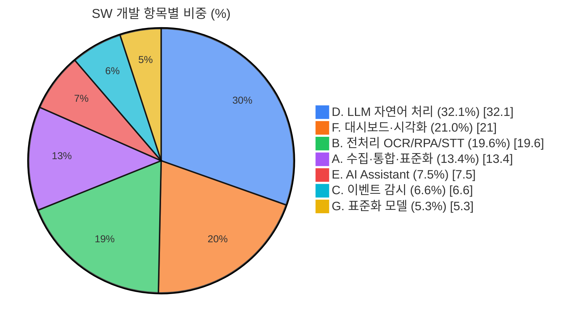
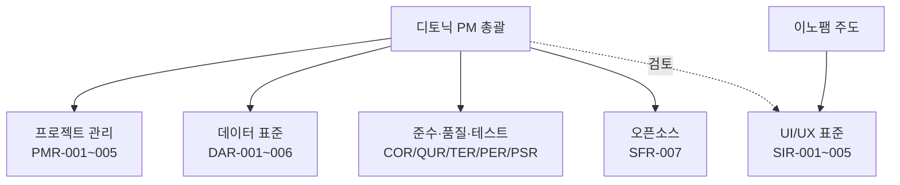
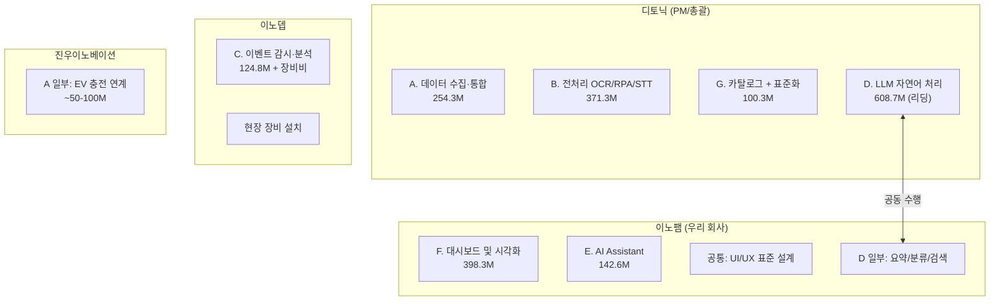
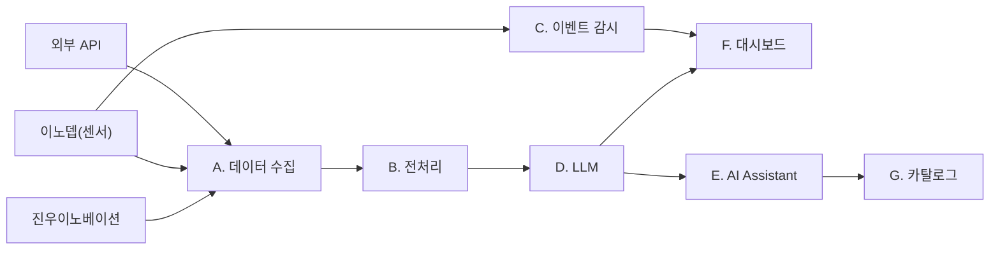

# 제주 스마트도시 데이터허브 시범솔루션 — 회사별 업무 배분 분석

> 작성일: 2026-03-31
> 총 사업비: 19억원 (VAT 포함), 개발기간: 계약 후 8개월
> 분석 근거: RFP 요구사항, 설계내역서(FP산정), 기타정보

---

## 1. 컨소시엄 구성

| 업체 | 기존 역할 정의 |
|------|---------------|
| **이노뎁** | 현장 장비 및 센서 설치 중심 |
| **진우이노베이션** | 전기차 등 정보 연계 중심 |
| **디토닉** | 빅데이터 데이터허브 플랫폼 및 LLM 메인 |
| **이노팸** (우리) | 대시보드 및 LLM 일부 |

---

## 2. 전체 작업 구조 및 금액

설계내역서 기준 SW 개발 항목별 금액과 FP(기능점수):

| # | 항목 | 금액 (백만원) | FP | 비중 |
|---|------|-------------|------|------|
| 01 | 데이터 수집·통합·표준화 | 254.3 | 134.6 | 13.4% |
| 02 | 데이터 전처리 (OCR/RPA/STT) | 371.3 | 351.0 | 19.6% |
| 03 | 데이터 분석 (이벤트 감시) | 124.8 | 114.3 | 6.6% |
| 04 | LLM 기반 자연어 처리 | 608.7 | 697.4 | 32.1% |
| 05 | AI Assistant | 142.6 | 134.7 | 7.5% |
| 06 | 대시보드 및 시각화 | 398.3 | 377.9 | 21.0% |
| 07 | 데이터 표준화 모델 | 100.3 | — | 5.3% |
| | **합계** | **약 2,000.3** | **1,809.9** | |

> 참고: 상세내역 합계 약 2,000.3M에서 설비/H/W 별도, SW 최종 합계 1,149.6M + 플랫폼 등 포함 시 총 19억

---

## 3. 공통작업 (회사 배분에서 제외)

아래 항목들은 **특정 회사가 아닌 전체 컨소시엄이 공동 수행**하거나, PM사(디토닉)가 총괄하는 영역:

### 3-1. 프로젝트 관리 (PMR)
- PMR-001~005: 사업수행 계획, 현황보고, 산출물 관리, 보안대책, 시큐어코딩
- → **디토닉 PM 총괄**, 각사 해당 부분 협조

### 3-2. UI/UX 표준 및 문서 (SIR)
- SIR-001: 화면UI표준 및 설계 가이드 수립
- SIR-002: 메뉴체계 수립
- SIR-004: 웹 표준 및 크로스브라우징
- SIR-005: UI/UX 통일 디자인
- → **이노팸 주도** (대시보드 담당이므로), 디토닉 검토

### 3-3. 데이터 표준 공통 (DAR 일부)
- DAR-001: 데이터 표준 수립 및 상위표준 준수
- DAR-002~006: 데이터 일반사항, 구조 설계, 검증, 관리 체계, 메타데이터
- → **디토닉 주도** (데이터허브 플랫폼 보유사), 각사 데이터 모델 협의

### 3-4. 준수·품질·테스트 (COR, QUR, TER, PER, PSR)
- COR-001~005: 법규, 개인정보보호, 저작권, SW사업정보 제출
- QUR-001~004: 품질 보증, 기능 정확성, 장애대응
- TER-001: 테스트 공통사항
- PER-001~002: 성능 보장, 응답시간
- PSR-001~004: 기술지원, 하자보수, 보안
- → **PM 총괄 + 각사 해당 모듈 자체 수행**

### 3-5. 오픈소스 (SFR-007)
- 전 모듈 오픈소스 공개, GitHub 배포, API 문서화, 라이선스
- → **각사 자기 모듈 오픈소스화**, PM이 통합 관리

---

## 4. 작업 그룹 분류 (공통 제외, 실질 개발 범위)

### 그룹 A — 데이터 수집·연계 인프라
**설계항목**: 01. 데이터 수집·통합·표준화 (254.3M, 134.6 FP)
**RFP**: SFR-001, DAR-007, DAR-008, ECR-001~004, SIR-003

핵심 내용:
- 민원 데이터 NGSI-LD 모델 정의 및 수집 (포털, 만덕콜센터)
- 센싱 이벤트(화재/온도/음향) 수집 체계
- 전기차 충전 인프라 데이터 연계
- 외부 API 연계 (기상청, 112/119)
- 통합관제 플랫폼 연계
- AI 서버(GPU), 망연계 시스템, RPA 솔루션, OCR 솔루션 도입
- 데이터 저장소 구축 (10종 이상)

### 그룹 B — 데이터 전처리 (AI)
**설계항목**: 02. 데이터 전처리 (371.3M, 351.0 FP)
**RFP**: SFR-002

핵심 내용:
- **OCR 처리**: 비정형 문서 인식, 필드 추출, 테이블 인식, 자기학습
- **RPA 수집**: 자동 로그인/수집, 스케줄링, Captcha 대응, 하이브리드 수집
- **STT 처리**: 음성→텍스트 변환, 화자 분리, PII 마스킹, 사투리 대응, WER 측정

### 그룹 C — 이벤트 감시·분석 (공영주차장 안전)
**설계항목**: 03. 데이터 분석 기능 (124.8M, 114.3 FP)
**RFP**: SFR-004

핵심 내용:
- 다중 모달리티(영상/음향/센서) 융합 AI 분석
- 화재·이상행동·사고 탐지 (3종 이상 이상탐지 기술)
- 단계별 경보 및 알림 (앱 푸시, SMS, 이메일, 웹훅)
- 대응 워크플로우 (SOP 체크리스트)
- 통합관제센터 연계

### 그룹 D — LLM 자연어 처리
**설계항목**: 04. LLM 기반 자연어 처리 (608.7M, 697.4 FP) — **최대 비중 32.1%**
**RFP**: SFR-002 일부, SFR-003 일부, SFR-005 일부

핵심 내용:
- **LLM 생성**: 프롬프트 템플릿, 응답 스키마, 톤/스타일, A/B 실험, PII 마스킹
- **LLM 요약**: 문단/문서/다문서/타임라인/주제별/부서별/시민용 요약 (12가지)
- **LLM 리라이팅**: 스타일 변환
- **LLM 검색**: 벡터 인덱스, 키워드/의미/하이브리드 검색, 리랭킹
- **LLM 질의응답**: 세션 관리, 대화형 Q&A
- **LLM 클러스터링**: 민원 군집화, 병합/분할
- **LLM 분류**: 단일/멀티/계층적 분류, 드리프트 감지
- 사용 모델: **LG 엑사원** (유료 버전)

### 그룹 E — AI Assistant
**설계항목**: 05. AI Assistant (142.6M, 134.7 FP)
**RFP**: SFR-005 일부

핵심 내용:
- 다국어 대응 (번역, FAQ)
- RAG 기반 정책문서 검색 및 근거 제시
- 대화형 행정 지원 인터페이스 (sLLM 기반)
- 추천 응답 (민원/정책/공문), 요약형/상세형/음성 응답
- 민원포털/통합플랫폼/만덕콜센터/외부 지자체 API 연계

### 그룹 F — 대시보드 및 시각화
**설계항목**: 06. 대시보드 및 시각화 (398.3M, 377.9 FP)
**RFP**: SFR-003, SFR-004 일부, SFR-005 일부

핵심 내용:
- **민원 분석 대시보드**: 히트맵, 읍면동 비교 카드, 시계열 분석, 불법주차 집중구역
- **정책 시뮬레이션**: 생활권 단위(그리드) 민원·수급·혼잡 분석, 정책 효과 예측
- **이벤트 감시 대시보드**: 경보 단계별/센서별/위치별 시각화
- **LLM 분석 결과 시각화**: 생성 리포트, 요약, 검색, 분류, 클러스터
- **AI Assistant 현황**: 상담 통계, 만족도, 정확도
- **종합 KPI 대시보드**: 전체 AI 솔루션 성과, 이상 탐지
- **보고서 자동 생성**: 월간/분기 정책 보고서, GIS 기반 시각화

### 그룹 G — 데이터 카탈로그 + 표준화
**설계항목**: 07. 데이터 표준화 모델 (100.3M) + SFR-006
**RFP**: SFR-006, DAR-008

핵심 내용:
- 웹 포탈 기반 데이터 카탈로그 UI
- NGSI-LD 표준 인터페이스 연동
- AI 기반 메타데이터 자동 추출/추천
- 표준 용어 사전 관리
- 자연어 기반 데이터 검색
- DCAT/DCAT-AP 형식 외부 제공
- TTA 표준(TTAK.KO-10.1331-Part4/R1) 반영

---

## 5. 회사별 업무 배분 제안

### 5-1. 배분 원칙

1. 각사의 **기존 역할 정의**를 최대한 존중
2. 디토닉의 경영 성향 반영 (자체 플랫폼 판매 중심, 파트너사 활용 선호)
3. 이노팸의 LLM 경험 축적 목적 반영 (디토닉 리딩 하에 공동 수행)
4. 모듈 간 **인터페이스 경계**를 명확히 하여 협업 충돌 최소화

---

### 5-2. 디토닉 (주관사/PM)

| 그룹 | 항목 | 금액 | 역할 |
|------|------|------|------|
| 공통 | PM, 프로젝트 관리, 산출물 총괄 | — | 총괄 |
| A | 데이터 수집·통합·표준화 | 254.3M | **메인** |
| B | 데이터 전처리 (OCR/RPA/STT) | 371.3M | **메인** |
| D | LLM 자연어 처리 | 608.7M | **리딩** (이노팸과 공동) |
| G | 데이터 카탈로그 + 표준화 | 100.3M | **메인** |

**근거**:
- 자사 데이터허브 플랫폼이 핵심 인프라이므로 데이터 수집·통합·표준화·카탈로그는 디토닉이 자연스럽게 주도
- 전처리(OCR/RPA/STT)는 데이터 파이프라인의 일부로 데이터허브와 밀접하게 연동
- LLM은 사업 경험이 많으므로 리딩하되, 이노팸에 경험 전수 목적으로 공동 수행
- 단, 디토닉 경영진 성향상 **실제 구현 인력 일부는 이노팸 등 파트너에 위임 가능**

**예상 금액대**: 약 700M~900M (디토닉 플랫폼 라이선스 별도)

---

### 5-3. 이노팸 (우리 회사)

| 그룹 | 항목 | 금액 | 역할 |
|------|------|------|------|
| F | 대시보드 및 시각화 | 398.3M | **메인** |
| D | LLM 자연어 처리 (일부) | 608.7M 중 일부 | **공동** (디토닉 리딩) |
| E | AI Assistant | 142.6M | **메인 또는 공동** |
| 공통 | UI/UX 표준 설계 | — | **주도** |

**근거**:
- 대시보드가 원래 역할이므로 06번 항목 전체를 메인으로 수행
- 대시보드가 전체 시스템의 최종 사용자 접점이므로, UI/UX 표준도 이노팸이 주도하는 것이 효율적
- LLM은 디토닉 리딩 하에 **요약·분류·검색 중 일부 모듈**을 직접 구현하며 경험 축적
- AI Assistant는 대시보드 내 대화형 인터페이스로 구현되므로 이노팸이 프론트엔드 + 일부 백엔드를 담당하면 자연스러움
- AI Assistant의 RAG/sLLM 백엔드는 디토닉과 공동

**예상 금액대**: 약 450M~600M

**이노팸이 가져갈 수 있는 LLM 세부 모듈 (제안)**:
- LLM 요약 (12가지 요약 중 시민용/부서별 등 대시보드 연동 부분)
- LLM 분류 (민원 자동 분류 → 대시보드 표시)
- LLM 검색 (대시보드 내 자연어 검색 기능)
- AI Assistant 프론트엔드 + 대화 관리

---

### 5-4. 이노뎁

| 그룹 | 항목 | 금액 | 역할 |
|------|------|------|------|
| C | 이벤트 감시·분석 (주차장 안전) | 124.8M | **메인** |
| A 일부 | 현장 장비 설치 (센서, CCTV 등) | ECR 장비비 별도 | **메인** |
| A 일부 | 센싱 이벤트 수집 체계 | — | **공동** |

**근거**:
- 현장 장비 및 센서 설치가 핵심 역할
- 공영주차장 9개소의 화재감지 센서, 음향 센서, CCTV 등 설치 및 연동
- 다중 모달리티 AI 분석(영상/음향/센서 융합)의 엣지 디바이스 및 수집 부분
- 이벤트 탐지 AI 모델 자체는 디토닉/이노팸과 협업 가능하나, 현장 연동은 이노뎁이 주도

**예상 금액대**: 약 200M~300M (장비비 별도)

---

### 5-5. 진우이노베이션

| 그룹 | 항목 | 금액 | 역할 |
|------|------|------|------|
| A 일부 | 전기차 충전 인프라 데이터 연계 | 254.3M 중 일부 | **메인** |
| A 일부 | EV 충전 이상행동 탐지 연동 | — | **공동** |

**근거**:
- 전기차 충전기 운영 데이터 수집·연계가 핵심 역할
- SFR-001의 "제주 전기차 충전기 운영 관련 데이터 수집·연계" 담당
- SFR-004의 "EV 충전 관련 이상 상황 행동 자동 탐지·분석" 데이터 제공 측
- 범위가 상대적으로 작으므로 연계 인터페이스 정의가 핵심

**예상 금액대**: 약 50M~100M

---

## 6. 업무 배분 요약도

---

## 7. 이노팸 관점 핵심 포인트

### 확보해야 할 것
1. **대시보드 전체 주도권**: 398.3M은 단일 모듈 중 두 번째로 큰 금액. 민원 분석, 이벤트 감시, LLM 결과, AI Assistant, 종합 KPI까지 모든 시각화를 아우르므로 사업 전체에 대한 이해도가 높아짐
2. **LLM 실전 경험**: 디토닉 리딩 하에 요약/분류/검색 모듈을 직접 구현하면, 향후 독립적으로 LLM 사업 수행 가능한 역량 확보
3. **AI Assistant 메인**: 대시보드 안에서 동작하는 대화형 인터페이스이므로 이노팸이 가져가기 자연스럽고, sLLM/RAG 경험까지 축적 가능

### 주의할 점
1. **인터페이스 명세 선확보**: 디토닉 데이터허브 → 대시보드 간 API 규격을 초기에 확정해야 병렬 개발 가능
2. **LLM 범위 합의**: "일부"의 경계가 모호하면 나중에 분쟁 소지. 모듈 단위로 명확히 합의 필요
3. **디토닉 인력 위임 가능성**: 디토닉이 자체 인력을 최소화하고 우리에게 더 많은 범위를 넘길 수 있음 → 기회이자 리스크 (역량 대비 과부하 가능)

---

## 8. 모듈 간 의존 관계

데이터 흐름이 **좌→우**로 진행되므로, 초기에 A(수집)와 B(전처리)가 먼저 안정화되어야 후속 모듈(D, E, F)이 정상 동작합니다. 이노팸 입장에서는 **디토닉의 데이터 파이프라인 완성 일정**이 우리 대시보드·LLM 일정에 직접 영향을 주는 핵심 의존성입니다.
