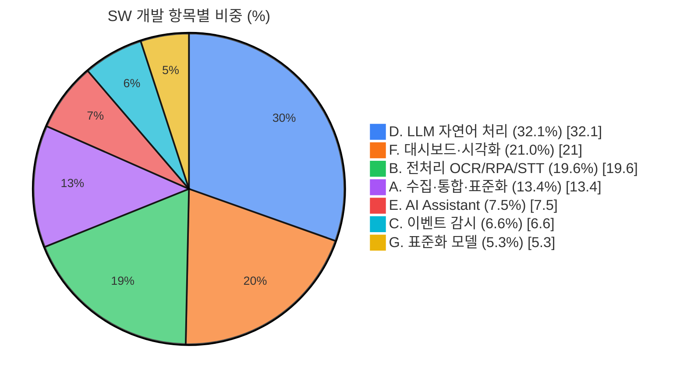
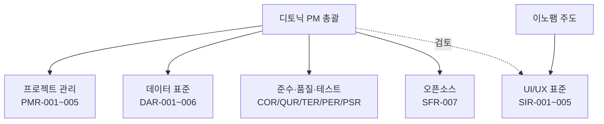
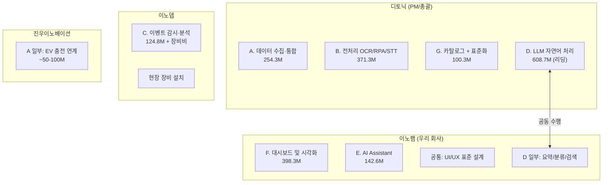
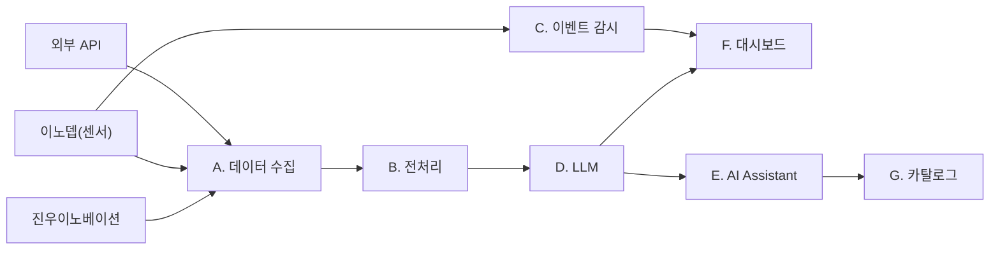

# 업무배분 분석 문서 Mermaid 시각화

> 대상 파일: `projects/제주-스마트도시-데이터허브-시범솔루션/docs/references/20260331/업무배분_분석.md`
> 작성일: 2026-03-31

---

## 목표

업무배분 분석 문서 내 ASCII 아트 및 테이블로 표현된 시각 정보를 Mermaid 다이어그램으로 변환하여 가독성과 유지보수성을 높인다.

---

## 변환 대상 (4건)

### 작업 1: SW 개발 항목별 비중 파이 차트

- **위치**: 섹션 2 (전체 작업 구조 및 금액)
- **현재 상태**: 테이블의 `비중` 컬럼에 % 수치만 존재
- **변환 유형**: `pie` 차트
- **변경 내용**: 섹션 2 테이블 아래에 Mermaid `pie` 차트 추가
- **완료 기준**: 7개 항목의 비중이 파이 차트로 표시됨

**색상 설계**: 색상환 균등 배치 + 인접 슬라이스 보색 대비 원칙 적용
| 슬라이스 | 색상 | Hex | 대비 관계 |
|----------|------|-----|----------|
| D. LLM | 파랑 | #3B82F6 | ↔ F(주황) 보색 |
| F. 대시보드 | 주황 | #F97316 | ↔ B(초록) 대비 |
| B. 전처리 | 초록 | #22C55E | ↔ A(보라) 보색 |
| A. 수집·통합 | 보라 | #A855F7 | ↔ E(빨강) 대비 |
| E. AI Asst. | 빨강 | #EF4444 | ↔ C(시안) 보색 |
| C. 이벤트 | 시안 | #06B6D4 | ↔ G(노랑) 대비 |
| G. 표준화 | 노랑 | #EAB308 | — |

---

### 작업 2: 공통작업 책임 구조 다이어그램

- **위치**: 섹션 3 (공통작업)
- **현재 상태**: 텍스트 목록으로 주도/협조 관계 서술
- **변환 유형**: `flowchart TB`
- **변경 내용**: 섹션 3 상단에 Mermaid 다이어그램 추가
- **완료 기준**: PM 총괄 → 각 공통업무, 이노팸 → UI/UX 주도 관계가 시각화됨

---

### 작업 3: 회사별 업무 배분 요약도

- **위치**: 섹션 6 (업무 배분 요약도)
- **현재 상태**: ASCII 박스 아트 (256~287행)
- **변환 유형**: `flowchart TB` (회사별 그룹핑)
- **변경 내용**: 기존 ASCII 아트 코드블록을 Mermaid 코드블록으로 **교체**
- **완료 기준**: 4개 회사의 담당 모듈과 금액이 시각화되고, 디토닉-이노팸 간 LLM 공동 수행 관계가 표현됨

---

### 작업 4: 모듈 간 의존 관계 (데이터 흐름도)

- **위치**: 섹션 8 (모듈 간 의존 관계)
- **현재 상태**: ASCII 화살표 (308~314행)
- **변환 유형**: `flowchart LR`
- **변경 내용**: 기존 ASCII 코드블록을 Mermaid 코드블록으로 **교체**
- **완료 기준**: 데이터 흐름이 좌→우로 표현되고, 외부 입력(진우/이노뎁/외부API) → 수집 → 전처리 → LLM → 대시보드 경로가 명확히 보임

---

## 수행 순서

1. **작업 4** (모듈 간 의존 관계) — ASCII 교체, 가장 효과 큼
2. **작업 3** (업무 배분 요약도) — ASCII 교체
3. **작업 1** (비중 파이 차트) — 테이블 아래 추가
4. **작업 2** (공통작업 책임 구조) — 섹션 상단 추가

## 검증 방법

- Markdown 프리뷰(VS Code 또는 GitHub)에서 4개 Mermaid 다이어그램이 정상 렌더링되는지 확인
- 기존 텍스트 내용과 다이어그램 정보가 일치하는지 대조
- 판단 기준: ASCII 아트 교체(작업 3, 4)는 원본 삭제, 추가(작업 1, 2)는 기존 내용 유지
